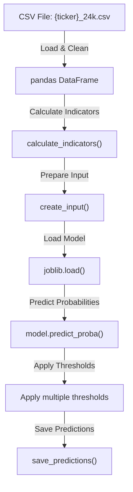
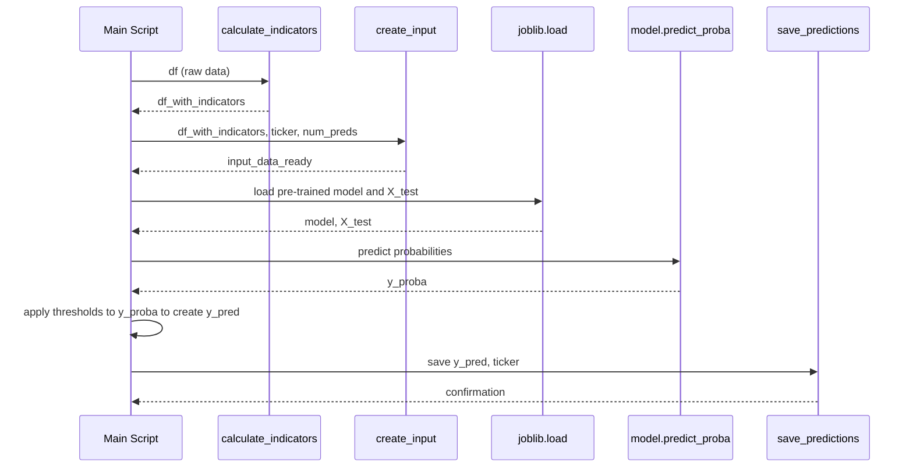

# `ModelServer/btc/test_main.py`

🔍 **Purpose:**  
Load new cryptocurrency data, calculate technical indicators, prepare input data, load a trained model, generate predictions at multiple thresholds, and save the results.

---

## Big-picture design goals  
Process recent price data and generate multiple thresholded predictions for evaluation and downstream use:
| Stage               | What we compute / do                 | How we do it                                            | UX payoff / goal                                   |
|---------------------|------------------------------------|---------------------------------------------------------|---------------------------------------------------|
| 1 · Load data       | Read CSV historical price data     | Use pandas to load and clean data                        | Reliable input without missing values             |
| 2 · Compute indicators | Add technical indicators            | Call `calculate_indicators` for features like SMA, RSI  | Enrich input with meaningful features             |
| 3 · Prepare input   | Format recent sequences for testing | `create_input` prepares input data sequences             | Data ready for model prediction                    |
| 4 · Load model      | Load pre-trained model              | Use `joblib.load` to restore XGBoost model               | Reuse trained model for inference                  |
| 5 · Predict labels  | Predict probabilities & threshold   | Generate predictions for multiple thresholds              | Evaluate model performance under various conditions|
| 6 · Save results    | Store predictions                   | Use `save_predictions` to update database or storage     | Persistent predictions for further use             |

---

## Relevant theory / tools
* **Pandas** – CSV reading and preprocessing  
* **Technical indicators** – features extracted from price data  
* **XGBoost** – pre-trained gradient boosting decision tree model  
* **Prediction thresholds** – generating binary outputs by varying probability cutoffs  
* **Joblib** – serialization library for saving/loading models and numpy arrays  
* **Numpy** – numerical operations and array reshaping  

---

## Test Pipeline Flowchart

