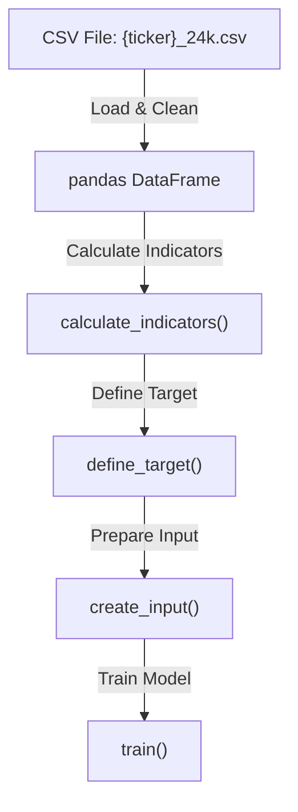
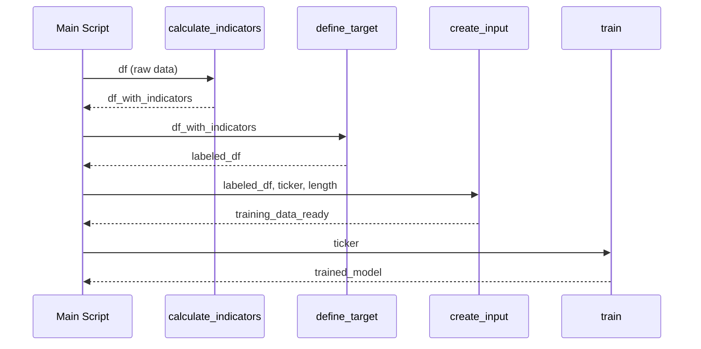

# `ModelServer/btc/train_main.py`

🔍 **Purpose:**  
Load historical cryptocurrency data, calculate technical indicators, prepare training inputs, and train a classification model to predict price direction (binary up/down).

---

## Big-picture design goals  
Process raw 5-minute candle data and create labeled training datasets for model training:
| Stage               | What we compute / do                 | How we do it                                            | UX payoff / goal                                   |
|---------------------|------------------------------------|---------------------------------------------------------|---------------------------------------------------|
| 1 · Load data       | Read CSV historical price data     | Use pandas to load and clean data                        | Reliable input with no missing values             |
| 2 · Compute indicators | Add technical indicators            | Call `calculate_indicators` for features like SMA, RSI  | Enrich input with meaningful features             |
| 3 · Define target   | Set binary target variable          | `define_target` to label if price goes up or down       | Supervised learning with clear label               |
| 4 · Prepare input   | Format data for model training      | `create_input` prepares sequences for model input       | Model-ready dataset for efficient training         |
| 5 · Train model     | Train ML model on prepared data     | Call `train` function to build classifier                | Obtain predictive model for future classification  |

---

## Relevant theory / tools
* **Pandas** – powerful CSV reading, cleaning, and dataframe manipulations  
* **Technical indicators** – features based on price/volume patterns (SMA, RSI, etc.)  
* **Supervised learning** – model learns from labeled up/down price movements  
* **Sequence input** – models typically need input sequences (e.g., sliding windows) for time series data
* **XGBoost** – Efficient gradient boosting library using decision trees, popular for fast, accurate classification and regression with built-in regularization.

---

## Data Pipeline Flowchart

