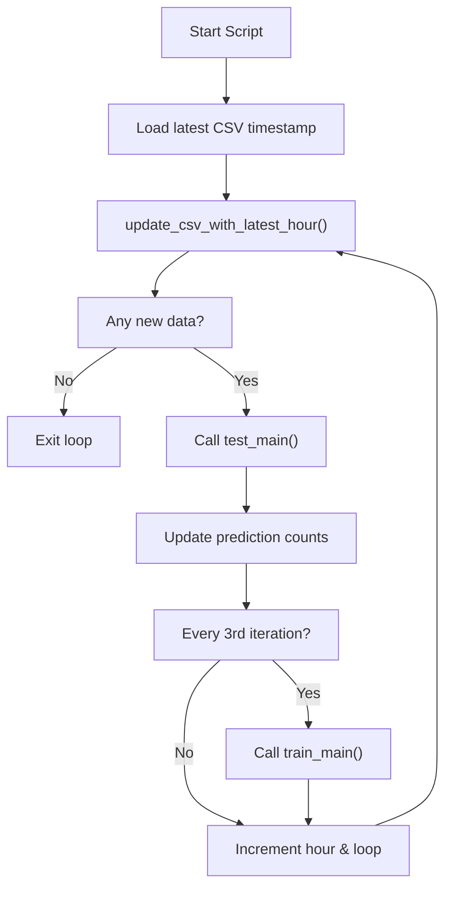
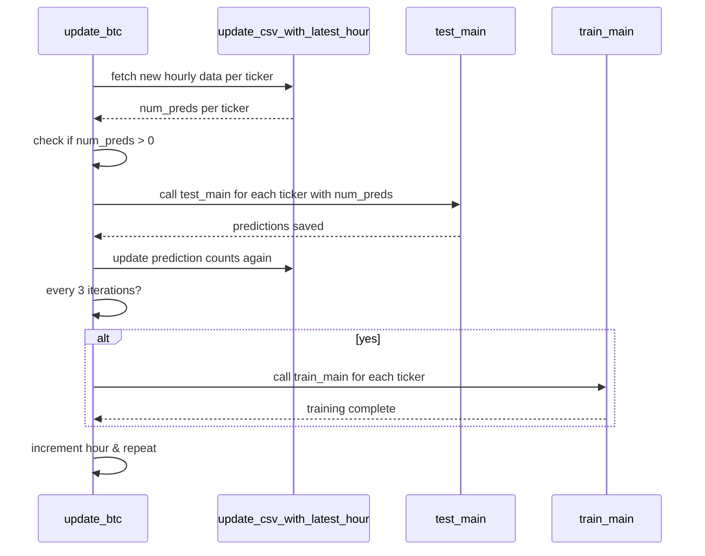

# `ModelServer/btc/update_btc.md`

🔍 **Purpose:**  
Automate updating cryptocurrency data by fetching new hourly data, running predictions with the latest model, and periodically retraining the model in a loop.

---

## Big-picture design goals  
Manage a continuous update loop for multiple tickers, orchestrating data fetching, prediction, and training:
| Stage                   | What we compute / do                            | How we do it                                                    | UX payoff / goal                                 |
|-------------------------|------------------------------------------------|-----------------------------------------------------------------|-------------------------------------------------|
| 1 · Read existing data  | Load last known data timestamp                   | Use pandas to read CSV and parse timestamps                     | Know where to resume updating                    |
| 2 · Fetch new data      | Append latest hourly data to CSV                 | Call `update_csv_with_latest_hour`                              | Keep dataset up to date                           |
| 3 · Run predictions     | Predict on new data with current model           | Call `test_main` with new data count                            | Get fresh predictions                             |
| 4 · Check prediction count | Update prediction counts per ticker             | Re-run data update function                                      | Track progress and determine loop continuation   |
| 5 · Periodic retrain    | Retrain model every 3 prediction cycles           | Call `train_main` after every 3 prediction batches              | Keep model performance up to date                  |
| 6 · Loop control       | Loop over tickers until no new data               | Increment hourly timestamps and iteration count                  | Automate continuous updates                        |

---

## Relevant theory / tools
* **Datetime & timezone** – handle UTC timestamps and timedeltas  
* **Pandas** – read and manipulate CSV dataframes  
* **Direct imports & calls** – Pythonic function calls to avoid overhead  
* **Control flow** – loop and conditionally retrain based on iteration count  
* **Modular design** – delegates prediction & training to separate modules  

---

## Update Loop Flowchart

