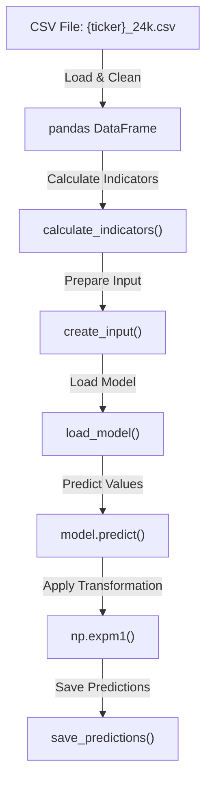
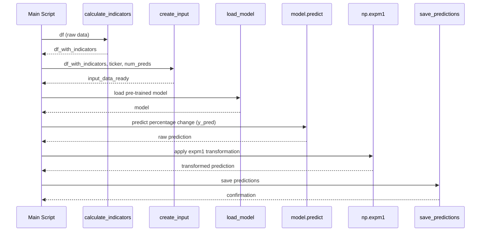

# 📈 **Crypto Prediction - BTC_PCT Regression Pipeline**

This repository contains the pipeline for predicting absolute cryptocurrency price change using an LSTM based Machine Learning Model. Specifically, the script loads an existing model and predicts absolute price change for the next hour of data.

---

## 🛠 **Big-Picture Design Goals**

The pipeline generates percentage predictions for cryptocurrency movements based on historical data:

| Stage               | What we compute / do                 | How we do it                                            | UX payoff / goal                                   |
|---------------------|--------------------------------------|---------------------------------------------------------|---------------------------------------------------|
| **1 · Load Data**       | Read CSV historical price data     | Use pandas to load and clean data                        | Reliable input without missing values             |
| **2 · Compute Indicators** | Add technical indicators            | Call `calculate_indicators` for features like RSI, MACD | Enrich input with meaningful features             |
| **3 · Prepare Input**   | Format sequences for model input    | `create_input` prepares input sequences                  | Data ready for model prediction                   |
| **4 · Load Model**      | Load pre-trained model              | Use `tensorflow.keras.models.load_model` to load Keras model | Reuse trained model for predictions            |
| **5 · Predict Labels**  | Predict future price change         | Use `model.predict` to get regression predictions        | Estimate the future percentage price change       |
| **6 · Save Results**    | Store predictions                   | Use `save_predictions` to store results in MongoDB      | Save the predictions for further analysis         |

---

## 🧑‍💻 **Test Pipeline Flowchart**

