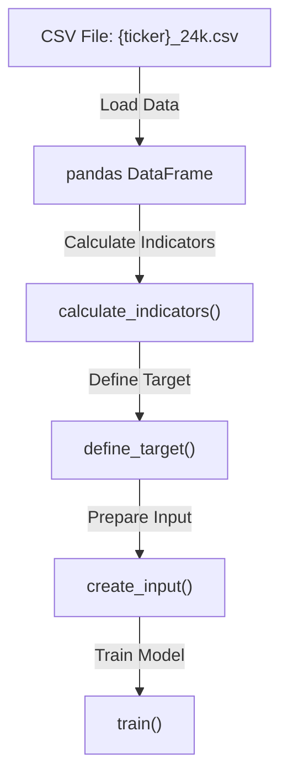
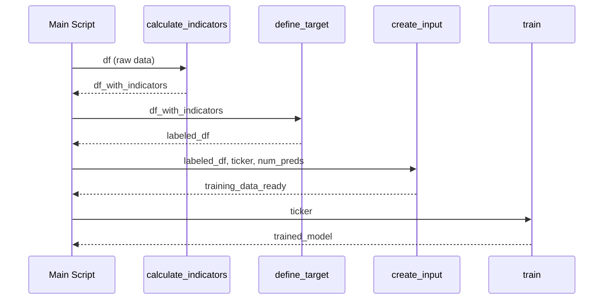

# `ModelServer/btc_pct/train_main.md`

🔍 **Purpose:**  
Load new cryptocurrency data and retrain an existing model on the new data.

---

## Big-picture design goals  
Process an hour of new 5-minute candle data into labeled sequences for supervised training of an LSTM regression model:
| Stage               | What we compute / do                 | How we do it                                            | UX payoff / goal                                   |
|---------------------|------------------------------------|---------------------------------------------------------|---------------------------------------------------|
| 1 · Load data       | Read CSV historical price data     | Use pandas to load data                                 | Reliable, clean input                              |
| 2 · Compute indicators | Add technical indicators            | Call `calculate_indicators` for features like SMA, RSI | Enrich input with meaningful features             |
| 3 · Define target   | Compute regression target           | Call `define_target` to set absolute pct change target | Clear supervised target for regression task       |
| 4 · Prepare input   | Format sequences for model training | Use `create_input` to build training sequences          | Model-ready datasets for LSTM training             |
| 5 · Train model     | retrain the LSTM model     | Call `train` function with prepared data                | Update model to improve predictive accuracy        |

---

## Relevant theory / tools
* **Pandas** – CSV reading and dataframe operations  
* **Technical indicators** – features based on price and volume data  
* **Supervised regression** – predicting continuous price changes  
* **LSTM** – recurrent neural network suited for time-series data  
* **Sequence input** – sliding window sequences for time dependence modeling  

---

## Data Pipeline Flowchart

