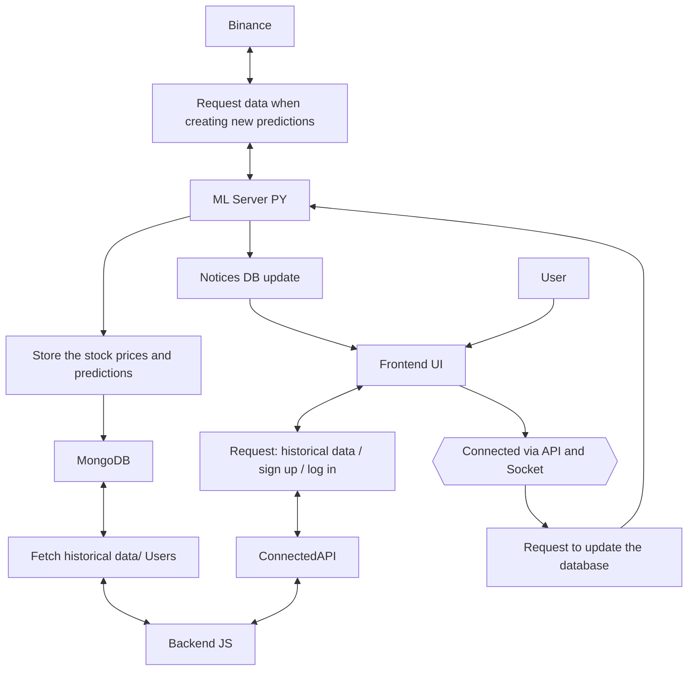

Welcome to **Crypto Prediction Platform**, an open-source, fully-containerised project that shows how you can **collect live crypto-market data, train machine-learning models continuously, and serve interactive forecasts to a web dashboard — all in real time and on your own machine**.

---

## 🔍 1  Why Does This Project Exist? <a id="introduction"></a>

### 1.1  The pain point

Retail traders and researchers face three recurring frustrations:

| Pain                        | Why it Hurts                                                                          | Typical “solution” today               |
| --------------------------- | ------------------------------------------------------------------------------------- | -------------------------------------- |
| **Black-box forecasts**     | Exchanges or paid APIs return a single price target with no explanation.              | Trust opaque signals or DIY notebooks. |
| **Stale data**              | Popular dashboards update every 15–60 min, long after a candle has finished printing. | Polling scripts, frequent manual updates.            |
| **Re-deployment headaches** | Getting Mongo / Redis / Python / Node to coexist is brittle, especially on Windows.   | Spend hours on environment setup.      |

### 1.2  Our promise

Crypto Prediction Platform turns those pain points into check-boxes:

* 🪄 **Explainable** — see confidence intervals and historical model predictions for different thresholds.
* ⚡ **Real time** — get new predictions every 5 min by simply clicking "Update".
* 🐳 **One command ⇢ working stack** — `docker compose up --build`, cross-platform, no manual DB installs.

End result? You open http://localhost:3000, pick your cryptocurrency, and instantly get clear, future-focused forecasts that help you anticipate market moves.

---

## 🎯 2  Project Objectives <a id="objectives"></a>

|  #  | Objective             | How We Deliver                                                                   |
| :-: | --------------------- | -------------------------------------------------------------------------------- |
|  1  | **Forecast accuracy** | Ensembe of LSTM and Xgboost Models                                               |
|  2  | **Durable storage**   | MongoDB 8 time-series collections (`ohlc_*`, `pct_*`, `binary_preds_*`).         |
|  3  | **Intuitive UI**      | React 18, TailwindCSS & ApexCharts, responsive.                                  |


*Bonus goodies:* JWT auth + Flask.

---

## 🏗️ 3  High-Level Architecture <a id="high-level-architecture"></a>


## 🧪 4 Technology & Theory <a id="technology--theory"></a>

| Layer          | Tech & Version                          | Why It’s Here                                                 |
| -------------- | --------------------------------------- | ------------------------------------------------------------- |
| Database       | MongoDB 8 (Time-Series)                 | Flexible schemas for multi-coin OHLC;                         |
| Cache / Broker | Redis 7                                 | WebSocket fan-out + Celery broker/result backend.             |
| JS API         | Node 18 + Express                       | Lightweight REST & WebSocket gateway.                         |
| Py API         | FastAPI 0.110                           | Async I/O.                                                    |
| ML stack       | scikit-learn, XGBoost, TensorFlow/Keras | Mix of tabular GBMs & sequence LSTMs, stacked for robustness. |
| Infra          | Docker 23, Compose 3.8                  | Reproducible, cross-platform                                  |


### 4.1 ML Models cheat‑sheet

**Target: log‑absolute percentage change**

$$
y_t = \log\left(1 + \left| \frac{P_t - P_{t-1}}{P_{t-1}} \right| \right)
$$

* **LSTM (regression)**
  * Predicts the magnitude of the move, $$\( {y}_t \)$$
  * **Loss:** Mean‑Squared Error (MSE)

* **XGBoost (classification)**
  * Predicts the direction (up / down) as a binary label \(\{0,1\}\)
  * **Loss:** Mean‑Squared Error (MSE) on the binary target


---

## 🛠️ 5 Setup & Installation <a id="setup--installation"></a>

### 5.1.1 Software You Must Install First

| Tool                                 | Windows                                                                                    | macOS | Linux                                      |
| ------------------------------------ | ------------------------------------------------------------------------------------------ | ----- | ------------------------------------------ |
| Docker Desktop (includes Compose v2) | ✅ [https://docker.com/products/docker-desktop](https://docker.com/products/docker-desktop) | ✅     | – (install Docker Engine + compose-plugin) |
| Git                                  | ✅ [https://git-scm.com/](https://git-scm.com/)                                             | ✅     | ✅                                          |
| (Optional) WSL 2                     | Enable “Windows Subsystem for Linux” + “Virtual Machine Platform”                          | n/a   | n/a                                        |
| (Optional) VS Code + Dev Containers  | Extension ID `ms-vscode-remote.remote-containers`                                          | ✅     | ✅                                          |

*Tip (Windows): Always run `wsl --update` + reboot → dramatically faster Docker volumes.*

### 5.1.2 Opening Docker Desktop

    Open the "Docker Dekstop" app:
    


    Click Accept, and than click skip.
    Than this page will open up :
    

    
    And wait for the docker to initiate (Wait untill it looks like this) :
    


### 5.2 Quick verification

```bash
# Verify versions:
docker --version      # should print 24.xx or newer
docker compose version
git --version
```

If any command errors, resolve before moving on.

---

## 🚀 6 Run the Whole Project Locally <a id="running-locally-docker"></a>

### 6.1 Run the web server
```bash
    1. Clone the repo
1) open vsc git clone https://github.com/snpdpy/nat-aar-yon-ba-2025
2)open a terminal and run the following command:
 docker-compose up --build
```
and you should see:


### Go to http://localhost:3000/
 and you will see:
 

 
### Sign Up to the website : 
    press on the sign up button, and fill the form: 
    


### If you already have a user, you can click on the log in button at the bottom


### After you sign up / log in. You will be redirected to this page :


### First, you will need to click on the "setting" button (Gear icon) in the top right.


In the setting menu, you can choose the stock you want to examine, and the type of graph you want to eximine with (For example, im using BTC stock and Cabdlestick graph).

### After that, you will need to click on "Dates" to choose the range of dates the graph will show.


### Than, you are able to add technical indicators by clicking "Indicators"(in the setting menu) :


Choose the settings of the indicator, and than click on "Add"

### How the indicators will look like in the graph :


If you wish to remove an indicator, you can do these either from the "Active Indicators" bar, or from the Indicators menu.

### If you are interested to see the model future predictions :
First, open the Indicator menu and enable predictions(Look in the top right):


A new purple line will be visible in the graph, this is the prediction of the model.

### If you wish to change the level of risk (Meaning, less risk = predicting *fewer* price rises. more risk = predicting *more* price rises)
Open the Setting menu and slide the "Risk Level", when 1 = *Most* risk and 9 = *least* risk


### To see the model future predictions
You will first need to change the end date to the current date. If it's not possible, click on the "Update Data" button on the top left :


After you got a notification that the data has succesfully updated, you can safely change the end date to the current date, and than :
Scroll to the most right points in the graph, and hover you cursor over the circles to see the predictions :


### To see the model performance
Click on the "Predictions" Button (top right of the screen):


A window will open up, and you will be able to see the model accuracy, precision and recall, as well as a confusion matrix and MSE


You will also see a graph in the bottom. The graph represents the moving accuracy, precision and recall for a slinding window.
You can change the size of the slinding window (1,2 and 3 hours), and also the class for which the metrices are calculated (Up / Down).


### 6.2 Shut down / reset

```bash
Ctrl+C                 # graceful stop
docker compose down    # keep volumes
docker compose down -v # nuke volumes (⚠️ wipes DB)
```

---


## 🆘 7 Troubleshooting <a id="troubleshooting"></a>

| Symptom                                                  | Likely Cause                                       | Fix                                                                                                                                  |
| -------------------------------------------------------- | -------------------------------------------------- | ------------------------------------------------------------------------------------------------------------------------------------ |
| Error: MongoDB connection not established in webapp logs | `CONNECTION_STRING` wrong or mongo not yet healthy | 1) Ensure `.env` points to `mongodb://mongo:27017/crypto_predictions`  2) Wait until mongo health-check passes before webapp starts. |
| Port 3000 already in use                                 | Another app (React dev server) running             | Change `WEB_PORT` in `.env` + `docker-compose.yml`.                                                                                  |
