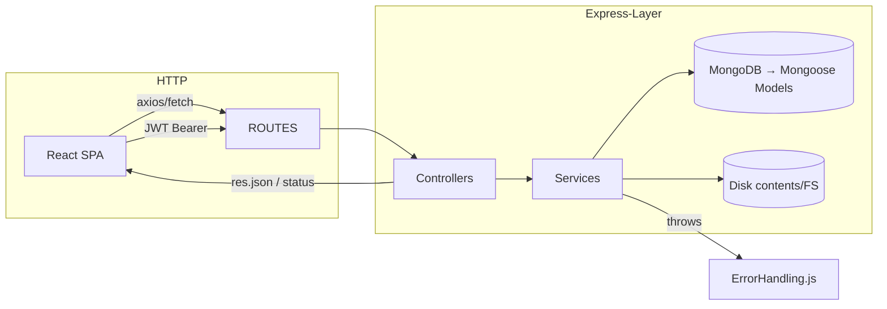
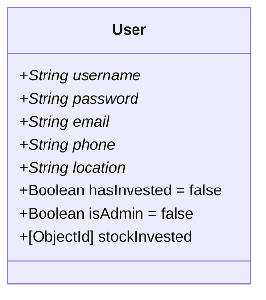
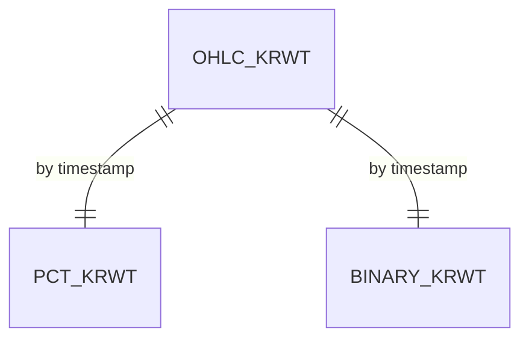
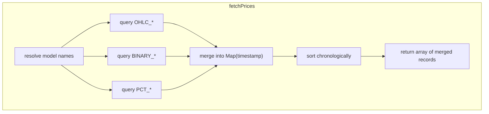
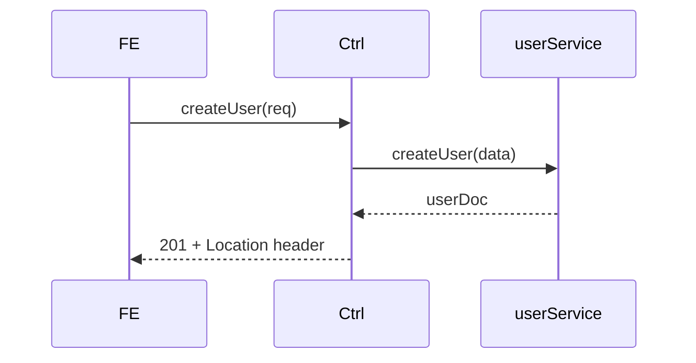
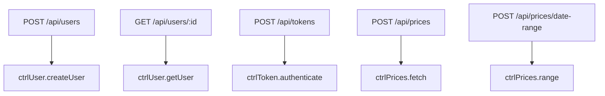
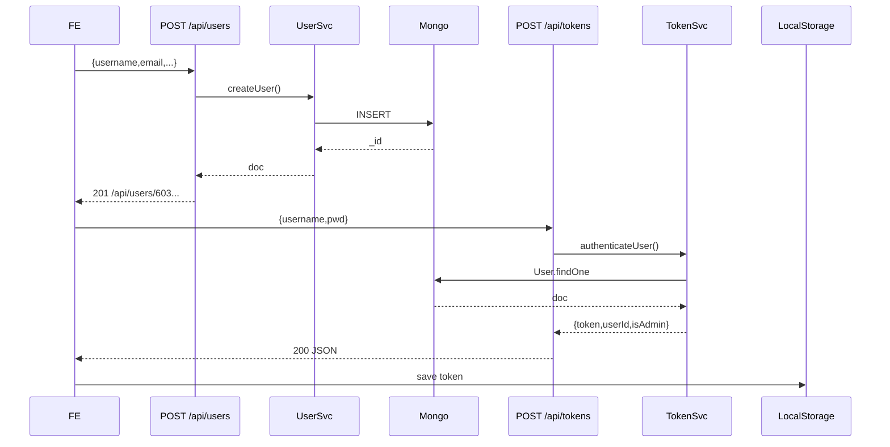
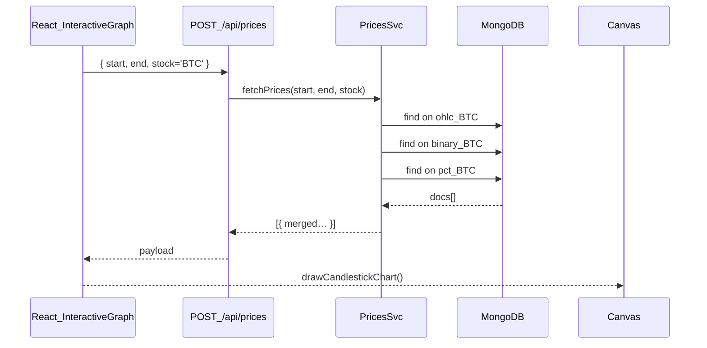

## Routes → Controllers → Services → Models → ErrorHandling
- **Routes**: glue path + verb → controller method  
- **Controllers**: stateless, orchestrate one service call, translate errors → HTTP  
- **Services**: business logic / joins / token sign; no `req`/`res`  
- **Models**: Mongoose schemas (dynamic per-stock)  
- **ErrorHandling**: guarantees JSON `{ error: msg }` for all uncaught throws  

---

## 1 · Technology Stack & Theory

| Layer   | Library / Pattern            | Why Chosen                                                     |
|---------|------------------------------|----------------------------------------------------------------|
| HTTP    | Express 5                    | Minimal middleware graph; full TypeScript defs if needed       |
| Data    | Mongoose over MongoDB        | Schema validation at server edge; dynamic collections          |
| Auth    | jsonwebtoken (HS256)         | Stateless; fits simple single-server deployment                |
| Images  | `fs.readFileSync` fallback   | Avoid 404 avatars; constant-time path resolution               |
| Dates   | ISO 8601 strings in DB       | No tz headaches; matches Python ETL export                     |
| Error   | Domain errors `{statusCode,msg}` | Services can raise layered errors; filter sanitises        |

2 · The Express Entry-Point
app.js

```js

const express = require('express');              // ① HTTP framework
const cors    = require('cors');                 // ② Cross-origin for React
const errorMW = require('./ErrorHandling');      // ③ Final error responder
...
app.use('/api/users',  require('./routes/user'));   // ④ MVC routers
app.use('/api/tokens', require('./routes/token'));
app.use('/api/prices', require('./routes/prices'));
...
app.use(errorMW.expressCatchAll);                // ⑤ JSON `{ error }` fallback
```
Pattern: Front Controller—single boot file wires cross-cutting concerns then hands off.

 (Mongoose)
 models/user.js – Identity & Profile



3.2 OHLC / Binary / PCT Dynamic Models
```js

// Generic factory (models/ohlc.js)
const schema = new mongoose.Schema({ /* open, high, low, close, volume, timestamp */ });
module.exports.getXModel = (coll) =>
  mongoose.models[coll] || mongoose.model(coll, schema, coll);
```

Pattern: Dynamic-collection allows new stocks (e.g. AAPL) with zero code changes.

 Services — Business Logic Brains
 services/user.js
Function	Algorithm

Instantiate & validate via Mongoose

save() → promise |

Validation and domain rules bubble errors as {statusCode,msg} for central handling.

4.2 services/token.js
```js

const jwt = require('jsonwebtoken');
exports.authenticateUser = async (u, pw) => {
  const user = await userSvc.getUserByName(u);
  if (!user || user.password !== pw) return null;
  return {
    userId: user._id,
    token: jwt.sign(
      { userId: user._id, isAdmin: user.isAdmin },
      secret,
      { expiresIn: '12h', algorithm: 'HS256' }
    ),
    isAdmin: user.isAdmin
  };
};
```
Stateless auth: no DB roundtrip after sign

12h expiry: balances usability with security

services/prices.js – Multi-Collection Join

Performance:

Use .select() to fetch only needed fields

Merge via Map for O(N) complexity

 services/content.js – Avatar Resolver
IF user.picture empty
  → read /contents/users/default/default.png
ELSE
  ext = path.extname(...)
  → read /contents/users/<username>.<ext>
RETURN { file, contentType }
Guarantees UI  never 404’s; fallback served in constant time.

Controllers — Thin Orchestration
 controllers/user.js

```js
try {
  const payload = await serviceCall();
  res.status(201).json(payload);
} catch (err) {
  res.status(err.statusCode||500).json({ error: err.message });
}
```
Controllers translate service results into HTTP responses, no business logic.

Routes — HTTP Grammar

Rule: Routes only string-match & param-extract; never transform business data.

Error Handling
ErrorHandling.js

```js

exports.filterError = (err) => {
  if (!err.statusCode) err = { statusCode: 500, message: 'Server Error' };
  throw err;  // bubble to expressCatchAll
};

exports.expressCatchAll = (err, req, res, _) =>
  res.status(err.statusCode || 500).json({ error: err.message });
```
Guarantees all error responses are JSON shape {error:string}; no stack leaks.

Token Verifier (Future-Proof)
```js

module.exports = (req, res, next) => {
  const token = req.headers.authorization?.split(' ')[1];
  if (!token) return res.status(401).json({ error: 'Missing token' });
  try {
    req.user = jwt.verify(token, secret);
    next();
  } catch (e) {
    res.status(403).json({ error: 'Invalid token' });
  }
};
```
Mount on /admin/* routes to secure endpoints.

Full Request Sequences
 Sign-Up then Login


InteractiveGraph Data Fetch


UI down-samples locally if > MAX_CANDLES; server remains agnostic.

## Data Down-Sampling
- UI down-samples locally if `> MAX_CANDLES`; server remains agnostic.

---

## Front-End Coupling Points

| Component             | API Endpoint                      | Data Fields Consumed                                                      |
|-----------------------|-----------------------------------|----------------------------------------------------------------------------|
| **LoginForm**         | `POST /api/tokens`                | `{ token, userId, isAdmin }`                                              |
| **SignUpForm**        | `POST /api/users`                 | Returns `201` + Location header on success                                 |
| **InteractiveGraph**  | `POST /api/prices`                | `open, high, low, close, volume, binary_predictions, pct_prediction`       |
| **Date-picker**       | `POST /api/prices/date-range`     | `{ start, end }`                                                           |
| **Avatar ``**    | `/api/contents/:username`         | Binary PNG / JPEG                                                          |

---

## Security & Future Work
- **Password hashing**: Switch to `bcrypt.hash(pwd, 12)` in `services/user.js`
- **HTTPS termination**: via Nginx; Express listens on `localhost` only
- **Rate limiting**: Mount `express-rate-limit` before `/api/prices`
- **Unit tests**: Use `mongodb-memory-server` to stub Mongoose; test services in isolation

---

## File-by-File Cheat Sheet

| Path                     | Responsibility                           | Major Exports                                            |
|--------------------------|------------------------------------------|----------------------------------------------------------|
| `controllers/user.js`    | HTTP ↔ userService glue                  | `createUser`, `getUser`                                  |
| `controllers/token.js`   | Login endpoint                           | `authenticateUser`                                       |
| `controllers/prices.js`  | OHLC + prediction join                   | `fetchPricesAndPredictions`, `fetchMinMaxDates`          |
| `services/user.js`       | CRUD + ID generation                     | `createUser`, `getUserBy*`                               |
| `services/token.js`      | JWT sign/verify                          | `authenticateUser`                                       |
| `services/prices.js`     | DB queries & merge logic                 | `fetchPrices`, `fetchMinMaxDates`                        |
| `services/content.js`    | Avatar stream                            | `getUserFiles`                                           |
| `routes/user.js`         | `/api/users` mapping                     | POST, GET `/:id`                                         |
| `routes/token.js`        | `/api/tokens` mapping                    | POST                                                     |
| `routes/prices.js`       | `/api/prices` mapping                    | POST, POST `/date-range`                                 |
| `models/*`               | Mongoose schemas & dynamic factories     | Factory functions & `User` schema                        |

---

## Glossary
- **MVC**: Routes = View mapping; Controllers = Controller; Services + Models = Model & Domain  
- **HS256**: HMAC-SHA256 symmetric JWT algorithm  
- **Dynamic collection**: Model factory pattern returning `mongoose.model(name, schema, name)`  
- **Down-sampling**: Client-side reduction of candles for FPS—no server change  
