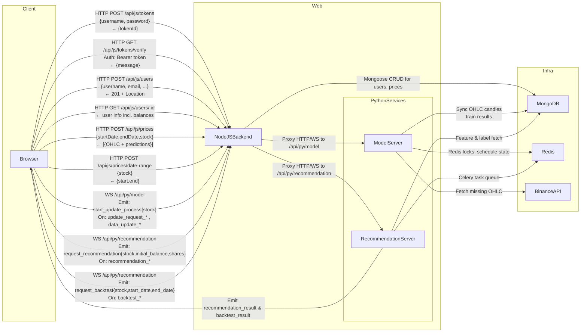

```mermaid
flowchart LR
    subgraph Client
        Browser
    end
    subgraph Web
        NodeJSBackend
        subgraph PythonServices
            ModelServer
            RecommendationServer
        end
    end
    subgraph Infra
        MongoDB
        Redis
        BinanceAPI
    end

    Browser -- "HTTP POST /api/js/tokens\n{username, password}\n← {tokenId}" --> NodeJSBackend
    Browser -- "HTTP GET /api/js/tokens/verify\nAuth: Bearer token\n← {message}" --> NodeJSBackend
    Browser -- "HTTP POST /api/js/users\n{username, email, ...}\n← 201 + Location" --> NodeJSBackend
    Browser -- "HTTP GET /api/js/users/:id\n← user info incl. balances" --> NodeJSBackend
    Browser -- "HTTP POST /api/js/prices\n{startDate,endDate,stock}\n← [{OHLC + predictions}]" --> NodeJSBackend
    Browser -- "HTTP POST /api/js/prices/date-range\n{stock}\n← {start,end}" --> NodeJSBackend

    Browser -- "WS /api/py/model\nEmit: start_update_process{stock}\nOn: update_request_* , data_update_*" --> NodeJSBackend
    Browser -- "WS /api/py/recommendation\nEmit: request_recommendation{stock,initial_balance,shares}\nOn: recommendation_*" --> NodeJSBackend
    Browser -- "WS /api/py/recommendation\nEmit: request_backtest{stock,start_date,end_date}\nOn: backtest_*" --> NodeJSBackend

    NodeJSBackend -- "Mongoose CRUD for users, prices" --> MongoDB
    NodeJSBackend -- "Proxy HTTP/WS to /api/py/model" --> ModelServer
    NodeJSBackend -- "Proxy HTTP/WS to /api/py/recommendation" --> RecommendationServer

    ModelServer -- "Sync OHLC candles\ntrain results" --> MongoDB
    ModelServer -- "Redis locks, schedule state" --> Redis
    ModelServer -- "Fetch missing OHLC" --> BinanceAPI

    RecommendationServer -- "Feature & label fetch" --> MongoDB
    RecommendationServer -- "Celery task queue" --> Redis
    RecommendationServer -- "Emit recommendation_result & backtest_result" --> Browser
```
