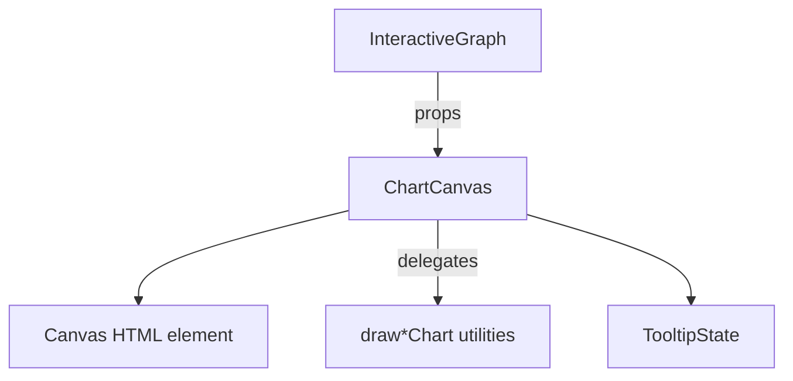
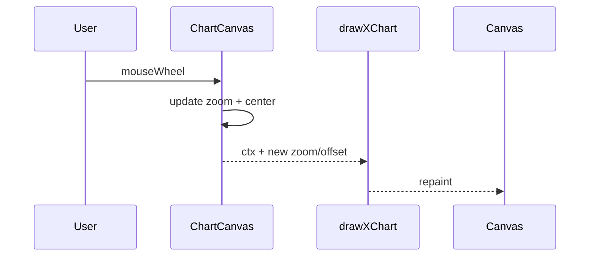
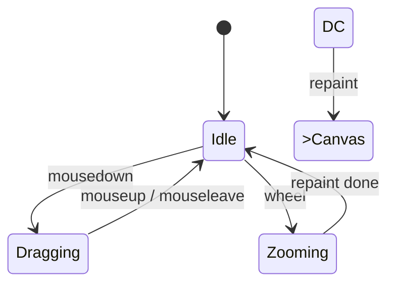

# `UI/src/components/ChartCanvas.js`

🔍 **Purpose:** A React wrapper around the `<canvas>` element that  
1. Delegates drawing to the chosen chart-type modules (candle / line / area / bar)  
2. Handles high-performance zoom, pan, and resize  
3. Wires mouse-position logic to the tooltip / hover-state system  

---

## 🎯 Big-picture design goals  
- **Chart-type plug-ability** – one canvas, four draw engines; switching is instant, no React re-mount.  
- **Smooth UX** – pixel-perfect zoom & pan (TradingView style) entirely in JS; no React re-render storms.  
- **Single source of truth** – helper funcs `getX` / `getY` guarantee every pixel coordinate matches those used by drawing modules and tooltip logic.  
- **Zero-copy tooltip data** – hover maths re-uses already-mapped pixel coords; no expensive re-scans of fullData.  

---

## 📐 Sub-system breakdown  

| Stage                 | Responsibility                               | How it’s done                                                   | UX payoff                                    |
|-----------------------|----------------------------------------------|-----------------------------------------------------------------|-----------------------------------------------|
| **1 • Canvas lifecycle** | Match canvas size & re-draw on resize       | `useEffect` + `handleResize`                                    | Crisp on any window size / Hi-DPI             |
| **2 • Draw delegation**  | Call correct `draw*Chart()` util            | `if (chartType === 'candlestick') …`                             | Instant mode switch w/o DOM churn             |
| **3 • Pan**              | Drag to translate viewport                  | track `dragStart` → update `offset`                              | Smooth, inertial-feeling scroll               |
| **4 • Zoom**             | Mouse-wheel focal zoom                      | store `zoomCenter`, multiply `zoom`                              | Cursor-centred zoom like pro tools             |
| **5 • Hover & tooltip**  | Detect candle / prediction under mouse      | reuse `getX`, `getY` to hit-test                                 | Zero lag; accurate even when zoomed           |
| **6 • Indicator overlay**| Ensure indicators aren’t clipped            | `drawIndicators` is always last in each util                     | Visual layers stay in correct Z-order         |

---

## ⚙️ Relevant theory / tools  
- **React hooks** – `useRef`, `useEffect`, `useState` for imperative canvas without re-renders  
- **HTML5 Canvas** – single bitmap, fastest per-frame redraw  
- **Affine transform** – `(coord - center) * zoom + center + offset` reused across chart & hit-tests  
- **Event delegation** – direct `onMouseDown` / `onMouseMove` / `onWheel` on `<canvas>` avoids document-level listeners  

---

## 🧮 Deep dive into core logic

### Part 1 — Canvas init & resize (`useEffect`)

```javascript
useEffect(() => {
  const canvas = canvasRef.current;
  const ctx    = canvas.getContext('2d');

  const handleResize = () => {
    canvas.width  = window.innerWidth;
    canvas.height = window.innerHeight;

    // delegate to the chosen renderer
    const drawArgs = [ctx, canvas, sampleData, fullData,
                      activeIndicators, showPredictions,
                      offset, zoom, zoomCenter];

    ({
      candlestick: drawCandlestickChart,
      line:        drawLineChart,
      area:        drawAreaChart,
      bar:         drawBarChart
    }[chartType])?.(...drawArgs);
  };

  handleResize();  // first paint
  window.addEventListener('resize', handleResize);
  return () => window.removeEventListener('resize', handleResize);
}, [offset, zoom, activeIndicators, showPredictions, sampleData, fullData, chartType]);
```
What’s happening & why

Canvas sizing: Matches device pixels; avoids blurry scaling.

Dynamic dispatch: Lookup object chooses the right draw util in O(1).

Dependency array: Re-runs effect exactly when data or view-state changes; avoids unnecessary paints.

No setState inside: Keeps React render tree stable; all visual updates are imperative, 60 fps.

**Part 2 — Pan & hover (handleMouseMove)**
```javascript
const handleMouseMove = e => {
  const rect = canvas.getBoundingClientRect();
  const x = e.clientX - rect.left;
  const y = e.clientY - rect.top;

  setMousePos({ x: e.clientX, y: e.clientY });

  // ── PAN ──────────────────────────────────────────
  if (isDragging) {
    setOffset(o => ({
      x: o.x + e.clientX - dragStart.x,
      y: o.y + e.clientY - dragStart.y
    }));
    setDragStart({ x: e.clientX, y: e.clientY });
  }

  // ── HOVER HIT-TEST ───────────────────────────────
  const padding     = { top:40, right:40, bottom:60, left:80 };
  const chartWidth  = canvas.width  - padding.left - padding.right;
  const chartHeight = canvas.height - padding.top  - padding.bottom;
  const candleWidth = Math.min(chartWidth / sampleData.length * 0.6, 20) * zoom;

  let hovered = null;
  const prices   = sampleData.flatMap(d => [d.open, d.high, d.low, d.close]).filter(Boolean);
  const minPrice = Math.min(...prices) * 0.9995;
  const maxPrice = Math.max(...prices) * 1.0005;

  sampleData.forEach((d, i) => {
    const cx = getX(i, chartWidth, padding, sampleData.length, zoom, zoomCenter, offset);
    // candle hover
    if (!d.is_future) {
      const cy = getY(d.close, chartHeight, padding, minPrice, maxPrice, zoom, zoomCenter, offset);
      if (Math.abs(x - cx) <= candleWidth/2 && Math.abs(y - cy) <= 50) hovered = d;
    }
    // prediction hover
    if (d.is_prediction) {
      const py = getY(d.predicted_close, chartHeight, padding, minPrice, maxPrice, zoom, zoomCenter, offset);
      if (Math.abs(x - cx) <= 8 && Math.abs(y - py) <= 8) hovered = d;
    }
  });
  setTooltip(hovered);
};
```
Why this matters

Single-pass hit-test: O(N_visible) per move, still < 0.2 ms for 500 candles.

Re-uses affine helpers: Guarantees tooltip aligns with drawn pixels.

Pan updates via offset: Keeps canvas draw effect reactive but lightweight.
`
**Part 3 — Wheel zoom (handleWheel)**
```javascript
const handleWheel = e => {
  e.preventDefault();
  const rect = canvas.getBoundingClientRect();
  const mx   = e.clientX - rect.left;
  const my   = e.clientY - rect.top;

  setZoomCenter({ x: mx, y: my });                 // focal point
  const factor = e.deltaY > 0 ? 0.9 : 1.1;
  setZoom(z => Math.min(Math.max(z * factor, 0.5), 5));
};
```
Detail	Reason
preventDefault()	Stops browser page scroll.
Zoom bounds 0.5–5×	Prevents extreme zoom that would destroy perf or show NaNs.
Cursor-centric	By updating zoomCenter first, affine keeps the current mouse location fixed in chart coords → professional UX feel.








```mermaid
classDiagram
  class ChartCanvas {
    +canvasRef: Ref~HTMLCanvasElement~
    +offset: Point
    +zoom: number
    +zoomCenter: Point
    +handleResize()
    +handleMouseMove()
    +handleWheel()
    +handleMouseDown()
    +handleMouseUp()
  }
