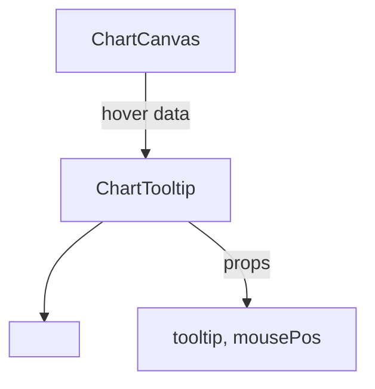
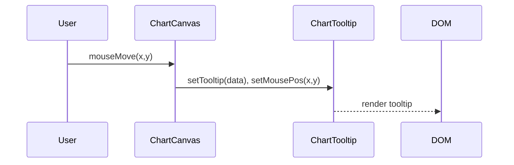
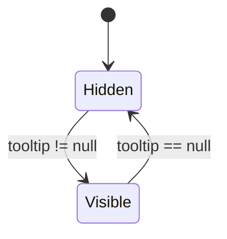

> **Purpose —** Render a floating tooltip box that displays either **historical OHLC data** or **ML prediction details** when the user hovers over a data point on any chart.

---

## 🎯 Big-picture design goals

1. **On-demand context**  
   Only mounts into the DOM when there’s actual hover data (`tooltip` prop), keeping the page lightweight.

2. **Cursor-linked positioning**  
   Offsets the box relative to `mousePos` so it never obscures the hovered candle/bar/point.

3. **Dual-mode content**  
   Seamlessly toggles between *historical* (Open/High/Low/Close ± prediction) and *future* (Predicted + Confidence) layouts.

4. **Styling consistency**  
   Uses shared CSS classes (`.tooltip`, `.tooltip-row`, `.tooltip-label`, etc.) to match the rest of the dark-theme chart UI.

---

## 📐 Sub-system breakdown

| Stage | Responsibility            | Implementation                              | UX payoff                            |
|:-----:|---------------------------|---------------------------------------------|--------------------------------------|
| **1** | Mount / unmount logic     | `if (!tooltip) return null`                 | Zero DOM noise when not hovering     |
| **2** | Positioning               | Inline style using `mousePos + [+10,-100]`  | Tooltip follows cursor smoothly      |
| **3** | Historical vs. Predicted     | `{tooltip.is_prediction ? … : …}` JSX ternary   | Clear separation of data modes       |
| **4** | Data formatting           | `.toLocaleString()`; `.toFixed(1)%`         | Locale-aware and precise display     |
| **5** | Semantic CSS classes      | `tooltip-title`, `tooltip-label.*`, `tooltip-value`  | Consistent colour cues (green/red/violet) |
| **6** | React purity              | Stateless functional component; pure render | Fast renders on prop change only     |

---

## ⚙️ Relevant theory & tools

- **React Functional Component**  
  Pure and side-effect-free.

- **Conditional Rendering**  
  Quick early return when no tooltip data.

- **Inline Styles**  
  Precise pixel placement without external CSS recalculation.

- **Locale-aware formatting**  
  Thousands separators and decimal points based on user locale.

- **Dark-theme UI**  
  Relies on existing CSS for glass-morphism background, rounded corners, and drop-shadow.

---

## 🧮 Deep algorithm walk-through

### 1️⃣ Early exit

```javascript
if (!tooltip) return null;
```
Why: Avoids mounting an empty <div> when nothing is hovered, saving unnecessary React tree updates.
```javascript
2️⃣ Positioning math
style={{
  left:  mousePos.x + 10,
  top:   mousePos.y - 100,
  transform: 'translate(-50%, 0)'
}}
```
+10px X-offset: nudges tooltip just right of the cursor.

-100px Y-offset: lifts it above the cursor to avoid covering the hovered element.

translate(-50%,0) horizontally centers the tooltip tip over the cursor.
```jsx
3️⃣ Title block
<div className="tooltip-title">{tooltip.time}</div>
```
Renders the timestamp of the hovered data point; CSS class applies accent styling.
```jsx
4️⃣ Conditional content
{tooltip.is_prediction ? (/* prediction JSX */) : (/* Historical JSX */)}
A. Future prediction layout
<div className="tooltip-row">
  <span className="tooltip-label future">Future Prediction:</span>
  <span className="tooltip-value">${tooltip.predicted_close.toLocaleString()}</span>
</div>
future label styled amber/gold.

probability label styled bold orange.

Values formatted with toLocaleString() and one decimal %.

B. Historical data layout
jsx
Copy
Edit
{['open','high','low','close'].map(key => (
  <div className="tooltip-row" key={key}>
    <span className={`tooltip-label ${key}`}>{key.charAt(0).toUpperCase()+key.slice(1)}:</span>
    <span className="tooltip-value">${tooltip[key].toLocaleString()}</span>
  </div>
))}
{tooltip.predicted_close && (
  <>
    <div className="tooltip-row">
      <span className="tooltip-label prediction">Predicted:</span>
      <span className="tooltip-value">${tooltip.predicted_close.toLocaleString()}</span>
    </div>
    <div className="tooltip-row">
      <span className="tooltip-label probability">Confidence:</span>
      <span className="tooltip-value">{(tooltip.probability * 100).toFixed(1)}%</span>
    </div>
  </>
)}
```
Dynamic mapping reduces repetition for OHLC rows.





```mermaid
classDiagram
  class ChartTooltip {
    +props tooltip:Object
    +props mousePos:Object
    +render():JSX
  }
