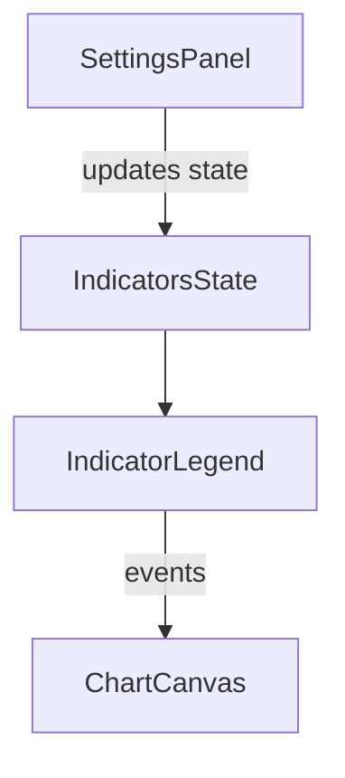
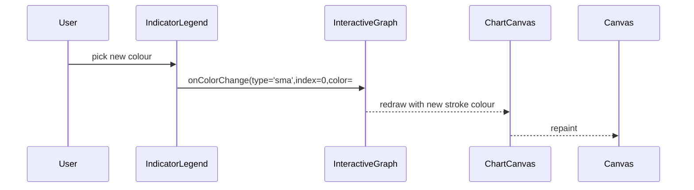
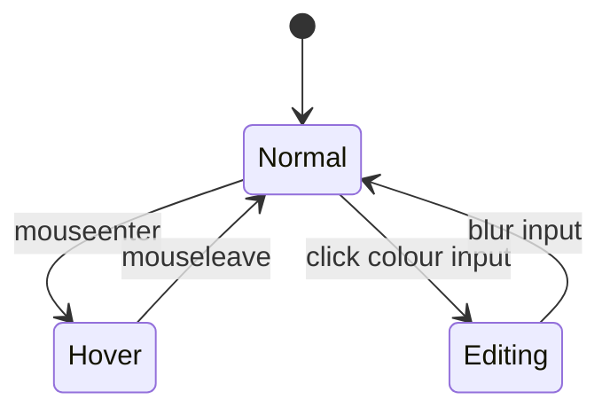
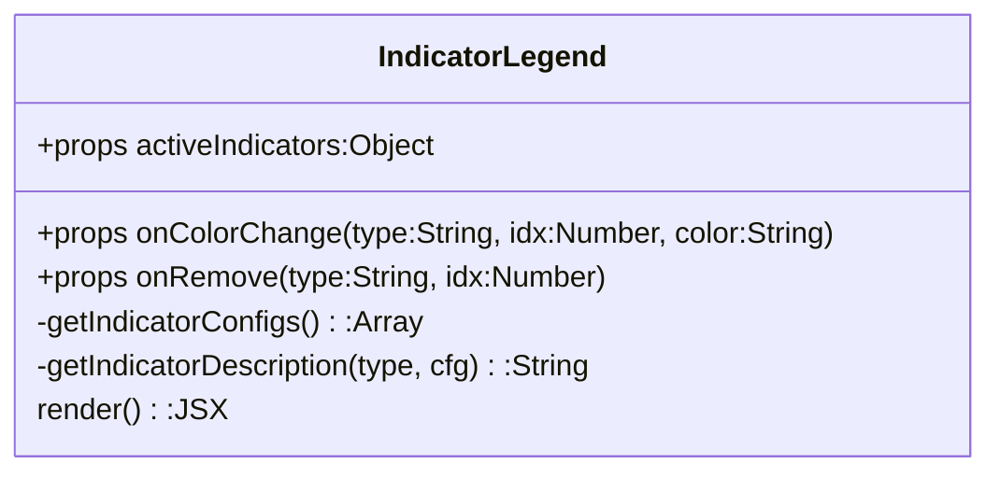

> **Purpose —** Render an interactive, badge-style legend listing every active technical indicator (SMA, EMA, RSI, MACD, Bollinger, Stochastic, ATR, Ichimoku). Shows parameters, lets users recolor applicable series, and offers a one-click “×” removal button.

---

## 🎯 Big-picture UX goals

| Goal                 | How the component fulfills it                                                                                            |
|----------------------|---------------------------------------------------------------------------------------------------------------------------|
| **Instant feedback** | Legend updates on every `activeIndicators` change; no page refresh needed.                                               |
| **Compact clarity**  | Each indicator appears as a pill: Label (with parameters) + colour swatch + remove button.                               |
| **Customization**    | Inline `<input type="color">` for SMA/EMA so users can differentiate overlapping moving averages.                        |
| **Removal control**  | Discrete “×” button lets users declutter the chart in one click.                                                          |
| **Dark-theme native**| All inline styles use a GitHub‐dark/Canvas‐dark palette (`#161b22`, `#21262d`, `#30363d`).                                 |

---

## ⚙️ Relevant tools & concepts

- **React functional component** – stateless, pure UI.  
- **Object→array flattening** – `Object.entries(activeIndicators)` flattens nested configs for easy `.map()`.  
- **Fallback palettes** – `DEFAULT_COLORS[index % n]` guarantees each series gets a colour even if none specified.  
- **CSS-in-JS (inline styles)** – avoids extra CSS files; keeps legend self-contained and themable by JS.

---

## 🧮 Detailed algorithm breakdown

### 1️⃣ Flatten `activeIndicators` → `configs[]`

```javascript
const configs = [];
Object.entries(activeIndicators).forEach(([type, cfgs]) => {
  cfgs.forEach((config, idx) => {
    configs.push({
      type,
      label: INDICATOR_LABELS[type],               // e.g. "SMA"
      config,
      index: idx,
      color: config.color || DEFAULT_COLORS[idx % DEFAULT_COLORS.length]
    });
  });
});
```
Why: The chart stores indicators grouped by type. The legend needs a flat list so one .map() can render all pills in a single flex-wrap container.

2️⃣ Colour editing
```jsx
{(item.type === 'sma' || item.type === 'ema') && (
  <input
    type="color"
    value={item.color}
    onChange={e => onColorChange(item.type, item.index, e.target.value)}
  />
)}
```
Why only SMA/EMA?

Those moving averages are often overlaid in multiples (10-, 20-, 50-period), and users need unique colours. Other indicators (RSI, MACD) live in sub-panes with fixed palettes.

3️⃣ Parameter description helper
```jsx
function getIndicatorDescription(type, config) {
  switch (type) {
    case 'sma':        return `(${config.period})`;
    case 'ema':        return `(${config.period})`;
    case 'macd':       return `(${config.fastPeriod},${config.slowPeriod},${config.signalPeriod})`;
    case 'bollinger':  return `(${config.period},×${config.multiplier})`;
    // …and so on
  }
}
```
Why: Embeds the key knobs directly in each pill so users recall “which line is the 14-period RSI vs. 28-period RSI” without opening a settings panel.

4️⃣ Remove indicator handler
```jsx
<button onClick={() => onRemove(item.type, item.index)}>×</button>
Contract: Parent passes onRemove(type, index).
```
Legend’s job: forward the event; parent updates activeIndicators state.

5️⃣ Empty-state UI
```jsx
if (configs.length === 0) {
  return <div className="empty">No indicators active</div>;
}
```
Why: Keeps the legend area from collapsing entirely; grey info box maintains layout stability.







🏆 Impact on product
Provides at-a-glance visibility of every overlay active on the chart.

Enables quick personalization (colour pickers + remove buttons) without deep menu navigation.

Maintains visual hierarchy: legend pills and chart lines share identical colour mapping, reducing cognitive load.
\
