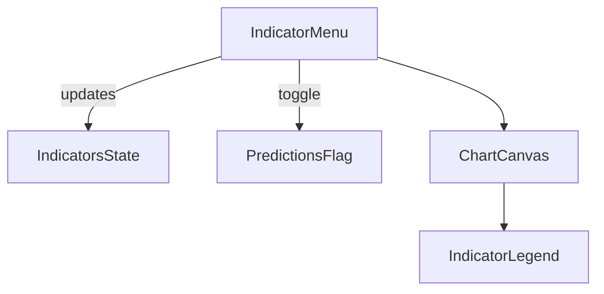
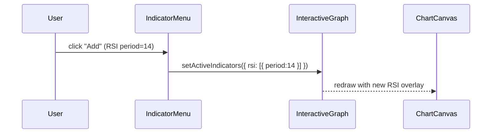
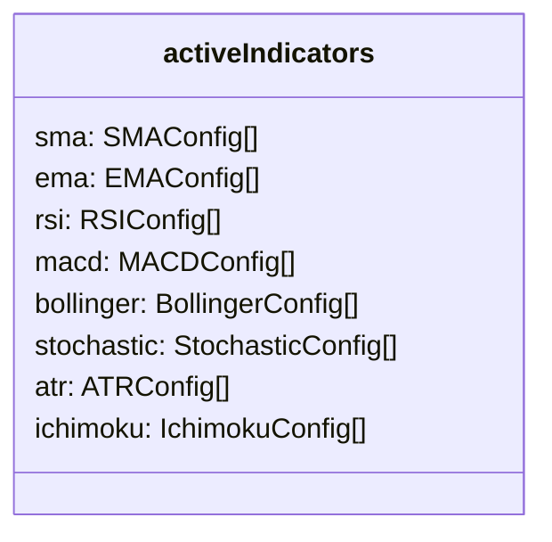
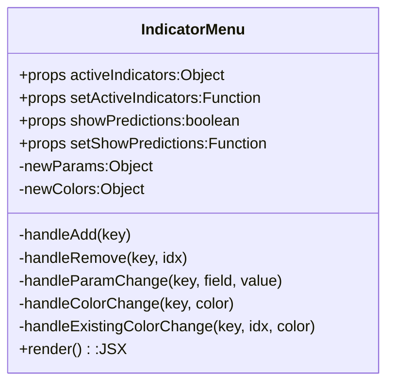

> **Purpose —** A self-contained “Technical Indicators” side-panel that lets users:
> 1. Toggle ML predictions  
> 2. Add / remove overlay & oscillator indicators  
> 3. Configure each indicator’s parameters and colour before adding to the chart

---

## 🎯 Big-picture UX goals

| Goal                      | Implementation highlight                                                                                     | Resulting UX benefit                                  |
|---------------------------|--------------------------------------------------------------------------------------------------------------|-------------------------------------------------------|
| **Zero-config defaults**  | `INDICATOR_DEFAULTS` pre-populate `newParams` so the Add button always works                                 | Fast onboarding for new users                         |
| **Colour disambiguation** | `DEFAULT_COLORS[idx % n]` assigns a unique fallback stroke to every added SMA/EMA instance                   | Overlapping lines are visually distinct               |
| **Inline editing**        | Numeric `<input>` boxes & `<input type="color">` live inside each indicator row                              | No modal pop-ups; instant feedback                    |
| **Idempotent updates**    | All state updates use `setActiveIndicators(prev => …)`                                                       | Prevents stale-closure bugs                           |
| **Reusable widgets**      | Same numeric input pattern repeated via helper functions (`handleParamChange`, `handleColorChange`)          | Consistent look & feel                                |

---

## ⚙️ Relevant tools & concepts

- **React functional component** – stateless, pure UI  
- **Object → array flattening** – `Object.entries(activeIndicators)` → flat list for rendering  
- **Fallback palettes** – `DEFAULT_COLORS[idx % n]` guarantees a colour even without user selection  
- **CSS-in-JS (inline styles)** – keeps legend/menu self-contained; no extra CSS files  

---

## 🧮 Deep algorithm walk-through

### 1️⃣ Local “staging” state

```javascript
const [newParams, setNewParams] = useState({
  sma:    { period: 14 },
  ema:    { period: 14 },
  rsi:    { period: 14 },
  // …etc.
});
const [newColors, setNewColors] = useState({
  sma: DEFAULT_COLORS[0],
  ema: DEFAULT_COLORS[1],
  // …
});
```
Why? Users can type a period or pick a colour before clicking Add.
Storing this locally keeps global activeIndicators clean until confirmed.

2️⃣ Adding an indicator
```javascript
const handleAdd = key => {
  const colorIndex = activeIndicators[key].length;
  const newConfig = (key === 'sma' || key === 'ema')
    ? { ...newParams[key], color: newColors[key] || DEFAULT_COLORS[colorIndex % DEFAULT_COLORS.length] }
    : { ...newParams[key] };

  setActiveIndicators(prev => ({
    ...prev,
    [key]: [...prev[key], newConfig]
  }));
};
```
Colour logic – MAs get custom colours; others use defaults inside chart util

Functional update – concurrency-safe with React’s batching

3️⃣ Removing an indicator
```javascript
const handleRemove = (key, idx) => {
  setActiveIndicators(prev => ({
    ...prev,
    [key]: prev[key].filter((_, i) => i !== idx)
  }));
};
```
Removes by index, preserving order (important for legend mapping).

4️⃣ Parameter UI generator (example: SMA block)
```jsx

<div className="indicator-item">
  <div style={{ fontWeight: 500 }}>SMA</div>

  {activeIndicators.sma.map((cfg, idx) => (
    <div key={idx} className="existing-config">
      <div className="color-swatch" style={{ background: cfg.color }} />
      <span>Period: {cfg.period}</span>
      <input
        type="color"
        value={cfg.color}
        onChange={e => handleExistingColorChange('sma', idx, e.target.value)}
      />
      <button onClick={() => handleRemove('sma', idx)}>×</button>
    </div>
  ))}

  {/* staging row */}
  <input
    type="number"
    value={newParams.sma.period}
    min={1}
    onChange={e => handleParamChange('sma', 'period', Math.max(1, +e.target.value))}
  />
  <input
    type="color"
    value={newColors.sma}
    onChange={e => handleColorChange('sma', e.target.value)}
  />
  <button onClick={() => handleAdd('sma')}>Add</button>
</div>
```
Why separate “active list” and “staging row”?
Keeps UX clear: existing indicators appear as editable chips; new config sits below awaiting Add.

5️⃣ ML-prediction toggle
```jsx
<label>
  <input
    type="checkbox"
    checked={showPredictions}
    onChange={() => setShowPredictions(!showPredictions)}
  />
  Predictions
</label>
```
One checkbox controls the violet dashed line for any chart type.







🏆 Product impact
Turns the chart into a sandbox for traders:

Stack unlimited SMAs, tweak MACD periods, or experiment with Bollinger multipliers in seconds

Immediate visual feedback builds trust and engagement (no “Apply” modal or page reload)

Re-usable colour palette + removal buttons keep the chart from becoming a rainbow mess
