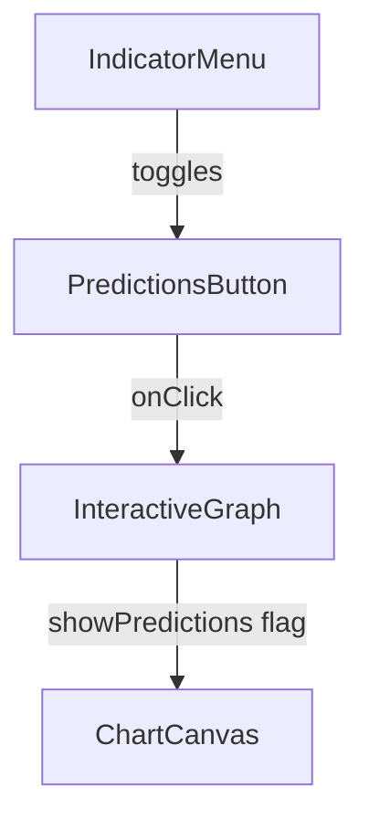
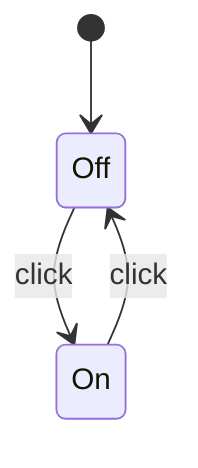
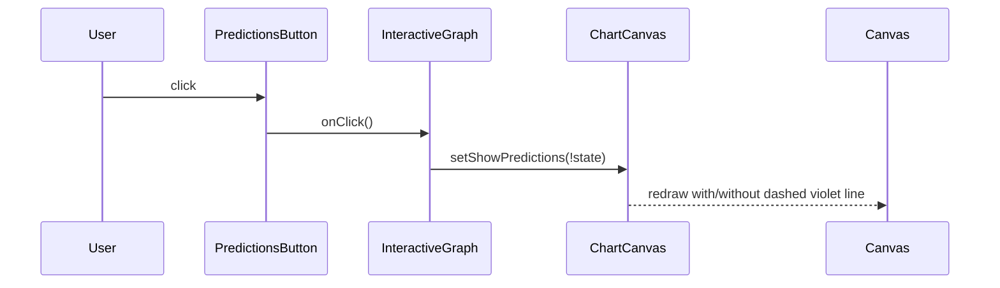

> **Purpose —** A small, self-contained toggle button that enables or disables the violet dashed “ML predictions” overlay on every chart. Its color and hover feedback give users instant clarity about whether they’re viewing historical data only or historical + model forecasts.

---

## 🎯 Design goals

| Goal                     | How the code achieves it                                          | UX payoff                                             |
|--------------------------|-------------------------------------------------------------------|-------------------------------------------------------|
| **Binary clarity**       | `background` switches between `#238636` (green) and `#21262d`     | Users can tell at a glance if predictions are on      |
| **Hover affordance**     | `onMouseEnter/Leave` shifts shade (`#2ea043` / `#30363d`)         | Subtle “button-ness” even in flat design              |
| **Icon + text**          | 16 × 16 SVG chart-tick icon + “Predictions” label                 | Quick recognition; readable at small sizes            |
| **Keyboard/pointer friendly** | Native `<button>` with `cursor:pointer` and focus outline | Accessible; honors user’s system high-contrast mode   |
| **Dark-theme consistency**    | Colors drawn from GitHub-dark palette (`#161b22`, `#21262d`) | Seamless visual integration with the rest of the app |

---

## 🧮 Code walkthrough

```jsx
export default function PredictionsButton({ onClick, isActive }) {
  return (
    <button
      onClick={onClick}                     // ① Parent toggles `showPredictions`
      style={{
        background: isActive ? '#238636'    // ② Active = green
                             : '#21262d',   //    Inactive = grey
        border: '1px solid #30363d',
        borderRadius: '6px',
        padding: '8px 16px',
        color: '#f0f6fc',
        fontSize: '14px',
        fontWeight: '500',
        cursor: 'pointer',
        display: 'flex',
        alignItems: 'center',
        gap: '8px',
        transition: 'all 0.2s ease',        // ③ Smooth hover shade shift
        marginRight: '12px'
      }}
      onMouseEnter={e => {                  // ④ Darken on hover
        e.target.style.background = isActive ? '#2ea043' : '#30363d';
      }}
      onMouseLeave={e => {                  // ⑤ Restore on leave
        e.target.style.background = isActive ? '#238636' : '#21262d';
      }}
    >
      {/* ⑥ Minimal line-chart icon (Feather style) */}
      <svg width="16" height="16" viewBox="0 0 24 24" fill="none" stroke="currentColor" strokeWidth="2" strokeLinecap="round" strokeLinejoin="round">
        <path d="M3 3v18h18" />
        <path d="M18.7 8l-5.1 5.2-2.8-2.7L7 14.3" />
      </svg>
      Predictions
    </button>
  );
}
```
Key points

Stateless — All state lives in the parent; this component simply calls onClick and reads isActive.

CSS-in-JS — No external stylesheet required; all colors and transitions are inline.

Accessible label — The visible “Predictions” text means screen readers announce its purpose.

SVG icon — Scales crisply on Hi-DPI and inherits currentColor for easy theming.








🏆 Impact
Immediate visual feedback — users know instantly whether predictions are shown.

Accessible & responsive — works with mouse, keyboard, and high-contrast settings.

Consistent look & feel — integrates seamlessly with dark-theme UI styling.

