> **Purpose —** Pop-up dashboard that computes classification metrics (accuracy, precision, recall) for the model’s “up/down” forecasts and visualises them in real time:
> - **Current‐candle snapshot** (large 24 px cards)  
> - **All‐time averages** (compact summary cards)  
> - **3-hour sliding‐window trend graph** (Canvas line chart)  
> - **Total forecast count**  

---

## 🎯 Big-picture design goals

| Goal                      | Implementation highlight                                 | UX payoff                                                       |
|---------------------------|----------------------------------------------------------|-----------------------------------------------------------------|
| **Quantify model quality**| `calculateMetrics()` + 3 h window loop                   | Traders instantly see signal reliability                        |
| **Trend insight**         | `metricsHistory[]` → `drawMetricsGraph()`                | Detect degradation or improvement over time                     |
| **Non-blocking UI**       | Fixed modal; heavy work in `useEffect` imperative draws  | Main chart stays at 60 fps                                      |
| **Flexible prediction**   | Fallback converts %-predictions to 0/1 via `pickBinary`  | Preps for future model types beyond binary                      |
| **Colour-semantic triad** | Accuracy=green, Precision=blue, Recall=amber            | Intuitive mapping (good 🟢, confidence 🔵, coverage 🟠)           |

---

## ⚙️ Key concepts & tools

| Concept                | How it’s applied                                                   |
|------------------------|--------------------------------------------------------------------|
| **Sliding window**     | `windowPts = floor((windowHours*60)/5)` → last 36 five-min bars    |
| **Classification**     | TP/FP/FN/TN → standard Accuracy, Precision, Recall formulas        |
| **Canvas immediate**   | Fast `drawMetricsGraph()` without React re-render overhead         |
| **Dark-theme palette** | Chart background `#0d1117`, grid `#21262d`, line strokes per triad|

---

## 🧮 Deep algorithm walk-through

### 1️⃣ `calculateMetrics(data, idx, threshold)`

```js
// ❶ Guard clauses
if (!data?.length) return zeros;
const hist = data.filter(p => !p.is_prediction);
if (!hist.length) return zeros;

// ❷ Window slice
const windowPts = Math.floor((windowHours*60)/5);
const start = Math.max(0, idx - windowPts);
const slice = hist.slice(start, idx+1);

// ❸ Confusion-matrix counts
slice.forEach(p => {
  const pred = pickBinary(p, threshold);
  if (pred == null || !p.actual_direction) return;
  if (pred === 1 && p.actual_direction === 'up') TP++;
  else if (pred === 1 && p.actual_direction === 'down') FP++;
  else if (pred === 0 && p.actual_direction === 'up') FN++;
  else if (pred === 0 && p.actual_direction === 'down') TN++;
});

// ❹ Metric formulas (%)
accuracy  = ((TP+TN)/total)*100;
precision = TP/(TP+FP)*100;
recall    = TP/(TP+FN)*100;
return { accuracy, precision, recall };
```
pickBinary uses either d.prediction (0/1) or % thresholds.

Returns all metrics as percentage-ready values.

2️⃣ drawMetricsGraph(canvas, metricsHistory)
```js
const ctx = canvas.getContext('2d');
const w = canvas.width, h = canvas.height;
const pad = { top:20, right:40, bottom:40, left:40 };

// 1. Clear & grid (5 lines)
ctx.fillStyle = '#0d1117';
ctx.fillRect(0,0,w,h);
ctx.strokeStyle = '#21262d';
for(let i=0;i<=4;i++){
  const y = pad.top + (i*(h-pad.top-pad.bottom)/4);
  ctx.beginPath();
  ctx.moveTo(pad.left, y);
  ctx.lineTo(w-pad.right, y);
  ctx.stroke();
}

// 2. Draw three lines
const keys = ['accuracy','precision','recall'];
const colors = { accuracy:'#238636', precision:'#58a6ff', recall:'#f59e42' };
keys.forEach(key => {
  ctx.strokeStyle = colors[key];
  ctx.beginPath();
  metricsHistory.forEach((m,i) => {
    const x = pad.left + i*( (w-pad.left-pad.right)/(metricsHistory.length-1) );
    const y = pad.top + (1 - m[key]/100)*(h-pad.top-pad.bottom);
    i===0 ? ctx.moveTo(x,y) : ctx.lineTo(x,y);
  });
  ctx.stroke();
});

// 3. Legend
keys.forEach((key,i) => {
  ctx.fillStyle = colors[key];
  ctx.fillRect(pad.left + i*80, h-30, 12,12);
  ctx.fillStyle = '#8b949e';
  ctx.fillText(key.charAt(0).toUpperCase()+key.slice(1), pad.left + i*80+18, h-18);
});
```
Canvas is 400 × 300 px with 20/40 px paddings.

Tri-colour lines map intuitively to the metrics triad.

3️⃣ useEffect — build metricsHistory[]
```js
useEffect(() => {
  if (!showMetrics) return;
  const hist = data.filter(p=>!p.is_prediction);
  const mh = hist.map((_,i) => calculateMetrics(data, i, threshold));
  drawMetricsGraph(canvasRef.current, mh);
}, [showMetrics, data, threshold]);
```
Runs only when the modal opens or data/threshold changes.

Imperative draw leaves React free for UI.

4️⃣ Modal composition
```jsx
<Modal onClose={onClose}>
  <h2>Model Metrics <button onClick={onClose}>×</button></h2>
  <div className="cards-current">
    {/* Big 24 px cards for last index */}
  </div>
  <div className="cards-average">
    {/* Compact summary of all-time metrics */}
  </div>
  <canvas ref={canvasRef} width={400} height={300}/>
  <div>Total predictions: {data.filter(d=>d.is_prediction).length}</div>
</Modal>
```
Header: title + close button

Current cards: large metrics for the most recent candle

Average cards: small 3-card grid for overall metrics

Trend graph: Canvas line chart

Footer: total forecast count

```mermaid
sequenceDiagram
  participant U  as User
  participant CC as ChartCanvas
  participant PM as PredictionsMetrics

  U->>CC: click "Metrics"
  CC->>PM: showMetrics=true, data passed
  PM->>PM: useEffect → build `metricsHistory`
  PM-->>Canvas: drawMetricsGraph()
```





🏆 Impact
Quantitative feedback → builds trust or skepticism in the ML overlay

Sliding-window view → reveals recent drift invisible to all-time averages

Lightweight canvas → no extra D3/Recharts, keeping bundle size and runtime cost low
