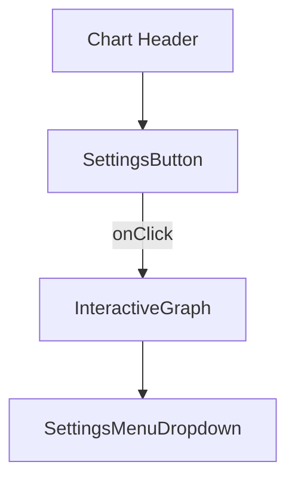
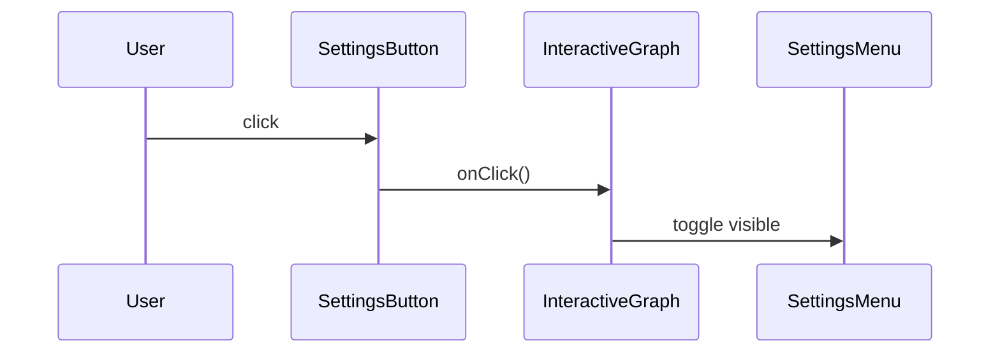
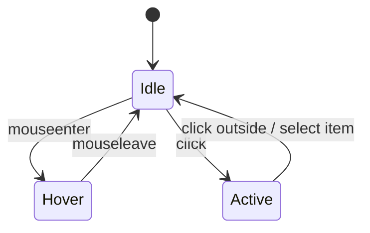
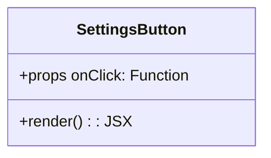

> **Purpose —** A circular “cog” icon button that opens the chart-level settings menu (panels for Indicators & Date Range). It lives in the top-right of every chart view, matches the dark-theme UI, and provides subtle hover feedback.

---

## 🎯 Design goals

| Goal                         | Code element that delivers it                                         | UX payoff                                                    |
|------------------------------|----------------------------------------------------------------------|--------------------------------------------------------------|
| **Icon clarity**             | 24 × 24 SVG cog outline                                             | Users instantly recognize “settings”                         |
| **Ample click target**       | `width:44px`, `height:44px`, `borderRadius:50%`                     | Meets WCAG 2.1 touch‐target guidance (≥ 44 px)               |
| **Theme consistency**        | `background: #23272f`, border-less, subtle box-shadow               | Seamless visual integration with chart header               |
| **Hover affordance**         | `transition: background 0.2s`; darker on `:hover` (via `.settings-icon-btn:hover`) | Visual confirmation of interactivity                         |
| **Accessibility**            | `aria-label="Settings"`                                             | Screen-reader announces button purpose                       |

---

## ⚙️ Relevant tools & concepts

- **React functional component** — pure render, no internal state.  
- **CSS-in-JS inline styles** — encapsulated styling, no external CSS file required.  
- **SVG icon** — scalable on Hi-DPI, strokes inherit from `currentColor` or explicit `stroke`.  
- **WCAG 2.1** — touch-target and focus outline courtesy of native `<button>` element.

---

## 🧮 Code walk-through

```jsx
export default function SettingsButton({ onClick }) {
  return (
    <button
      onClick={onClick}                 // ① Delegate click event to parent
      className="settings-icon-btn"
      style={{
        background: '#23272f',          // ② Default dark fill
        border: 'none',
        borderRadius: '50%',            // Circular shape
        width: 44,                      // WCAG tap target ≥ 44px
        height: 44,
        display: 'flex',
        alignItems: 'center',
        justifyContent: 'center',
        boxShadow: '0 2px 8px rgba(0,0,0,0.10)',
        cursor: 'pointer',
        transition: 'background 0.2s',
        outline: 'none',
        padding: 0
      }}
      aria-label="Settings"             // ③ Accessibility label
    >
      {/* ④ Feather-style cog icon (stroke inherits white) */}
      <svg width="24" height="24" viewBox="0 0 24 24" stroke="#fff" strokeWidth="2" fill="none">
        <circle cx="12" cy="12" r="3.5"/>
        <path d="M19.4 15a1.65 1.65 0 0 0 .33 1.82l.06.06a2 2 0 1 1-2.83 2.83l-.06-.06A1.65 1.65 0 0 0 15 19.4a1.65 1.65 0 0 0-1.5 1.1V21a2 2 0 1 1-4 0v-.09A1.65 1.65 0 0 0 9 19.4a1.65 1.65 0 0 0-1.82-.33l-.06.06a2 2 0 1 1-2.83-2.83l.06-.06A1.65 1.65 0 0 0 4.6 15a1.65 1.65 0 0 0-1.1-1.5H3a2 2 0 1 1 0-4h.09A1.65 1.65 0 0 0 4.6 9a1.65 1.65 0 0 0-.33-1.82l-.06-.06a2 2 0 1 1 2.83-2.83l.06.06A1.65 1.65 0 0 0 9 4.6c.2-.08.41-.13.62-.16V3a2 2 0 1 1 4 0v.09c.21.03.42.08.62.16a1.65 1.65 0 0 0 1.82.33l.06-.06a2 2 0 1 1 2.83 2.83l-.06.06A1.65 1.65 0 0 0 19.4 9c.08.2.13.41.16.62H21a2 2 0 1 1 0 4h-.09c-.03.21-.08.42-.16.62z"/>
      </svg>
    </button>
  );
}
```
Key points
Single prop (onClick) — parent component decides which settings panel to open.

Stateless — no internal useState; purely presentational and reusable.

Native <button> — delivers built-in focus outline for keyboard navigation.

Inline styling — keeps component portable across pages without extra CSS imports.







🏆 Why it matters
Central entry point for all chart customization—users intuitively look for the cog.

Stateless & style-encapsulated—reusable across dashboard, watchlist, etc., with no additional CSS.

Accessible & responsive—meets touch-target and keyboard navigation requirements.

