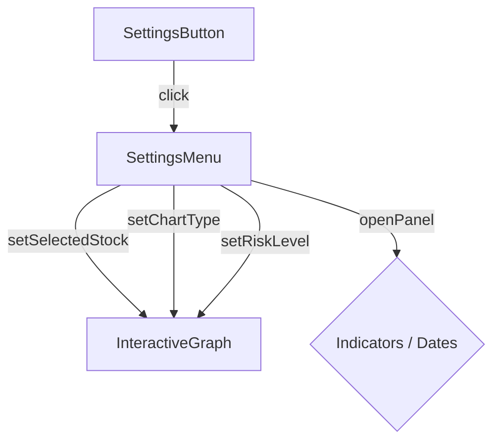
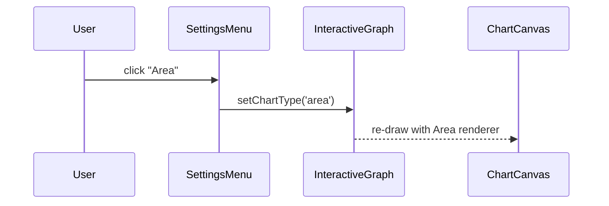
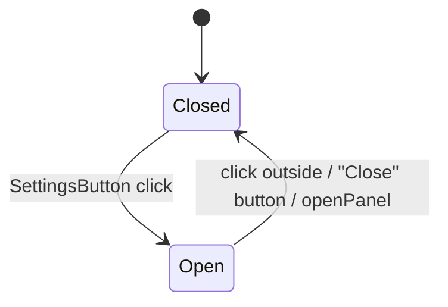

> **Purpose —** A floating drop-down panel that centralises high-level chart configuration:
> - **Stock picker**  
> - **Chart‐type switcher** (Candle / Line / Area / Bar)  
> - **Risk‐level slider** (1–9) feeding the back-end strategy engine  
> - **Short-cuts** to open the Indicators and Date-Range side-panels  
>  
> It appears when the ⚙️ **SettingsButton** is clicked and auto-closes when a sub-panel is opened or the user clicks outside.

---

## 🎯 Big-picture UX goals

| Goal                                    | Implementation highlight                                      | UX payoff                                                              |
|-----------------------------------------|---------------------------------------------------------------|------------------------------------------------------------------------|
| **Single source of truth**              | Receives `selectedStock`, `chartType`, `riskLevel` & their setters from parent | Changing a control re-draws chart in <50 ms                            |
| **Compact but touch-friendly**          | Buttons (28–34 px tall, 6–10 px padding)                      | Works on desktop & tablet                                              |
| **Dark-theme native**                   | Backgrounds `#23272f`/`#161b22`, borders `#404040`           | Seamless visual integration                                            |
| **Immediate visual feedback**           | Active option gets 2 px cyan outline & filled background      | Users know exactly what’s live                                         |
| **Keyboard accessible**                 | Native `<button>` + `<input type="range">` with default focus| WCAG-compliant, usable without a mouse                                 |

---

## 🏗 Sub-system breakdown

| Section         | Responsibility          | Key props / state                 | Notes                                                  |
|-----------------|-------------------------|-----------------------------------|--------------------------------------------------------|
| **Stocks**      | Change `selectedStock`  | `STOCKS` constant drives pills    | Could be extended to searchable dropdown               |
| **Chart Type**  | Change `chartType`      | `CHART_TYPES` constant            | Icon previews could be added                            |
| **Risk Slider** | Set `riskLevel` (1–9)   | `<input type="range">` + badge    | Value flows directly to ML serving layer                |
| **Panel Short-cuts** | Toggle side-panels | `handlePanelClick(panel)` sets `openPanel` + `onClose()` | Ensures only one panel is open at a time |
| **Close**       | Dismiss dropdown        | Calls parent `onClose()`          | Also auto-closes when clicking outside                  |

---

## 🧮 Code deep-dive

### 1️⃣ Panel click handler

```js
const handlePanelClick = panel => {
  setOpenPanel(panel);   // open Indicators or Dates
  onClose();             // hide this dropdown
};
```
Why: Ensures the dropdown doesn’t overlap the newly-opened side-panel.

2️⃣ Stock pills rendering
```jsx

{STOCKS.map(stock => (
  <button
    key={stock.value}
    onClick={() => setSelectedStock(stock.value)}
    style={{
      border: selectedStock === stock.value
                ? '2px solid #4fc3f7'
                : '1px solid #404040',
      background: selectedStock === stock.value
                ? '#4fc3f7'
                : '#161b22',
      color: selectedStock === stock.value ? '#000' : '#fff',
      padding: '6px 10px',
      margin: '4px',
      borderRadius: '4px'
    }}
  >
    {stock.value}
  </button>
))}
```
Visual state: cyan fill + bold text when active.

Flex-wrap: pills wrap gracefully even if many tickers are listed.

3️⃣ Chart-type pills
```jsx
Same pattern as stocks, using CHART_TYPES.map(({ value, label }) => …)

Text = label (e.g. “Area”)

Value = value (e.g. “area”)
```
4️⃣ Risk slider
```jsx

<div className="risk-slider">
  <label>Risk Level: {riskLevel}</label>
  <input
    type="range"
    min="1"
    max="9"
    step="1"
    value={riskLevel}
    onChange={e => setRiskLevel(Number(e.target.value))}
  />
</div>
```
Number() prevents string state bugs.

Badge next to label echoes the current value.

5️⃣ Button list (Indicators / Dates / Close)
```jsx
<button
  className={`settings-menu-btn${openPanel === 'indicators' ? ' active' : ''}`}
  onClick={() => handlePanelClick('indicators')}
>
  Indicators
</button>
<button
  className={`settings-menu-btn${openPanel === 'dates' ? ' active' : ''}`}
  onClick={() => handlePanelClick('dates')}
>
  Dates
</button>
<button className="settings-menu-close" onClick={onClose}>
  Close
</button>
```
Active state: cyan text & background via .active class.

Close button returns focus to the chart header.





```mermaid
classDiagram
  class SettingsMenu {
      +props openPanel:String
      +props setOpenPanel:Function
      +props onClose:Function
      +props chartType:String
      +props setChartType:Function
      +props selectedStock:String
      +props setSelectedStock:Function
      +props riskLevel:Number
      +props setRiskLevel:Function
      -handlePanelClick(panel:String)
      +render():JSX
  }
🏆 Impact
```

One-tap customization dramatically reduces clicks vs. old multi-modal flow.

Risk slider surfaces quantitative control directly to the backend strategy engine without burying it.

Clean separation between high-level settings (this dropdown) and detailed side-panels keeps cognitive load manageable.

