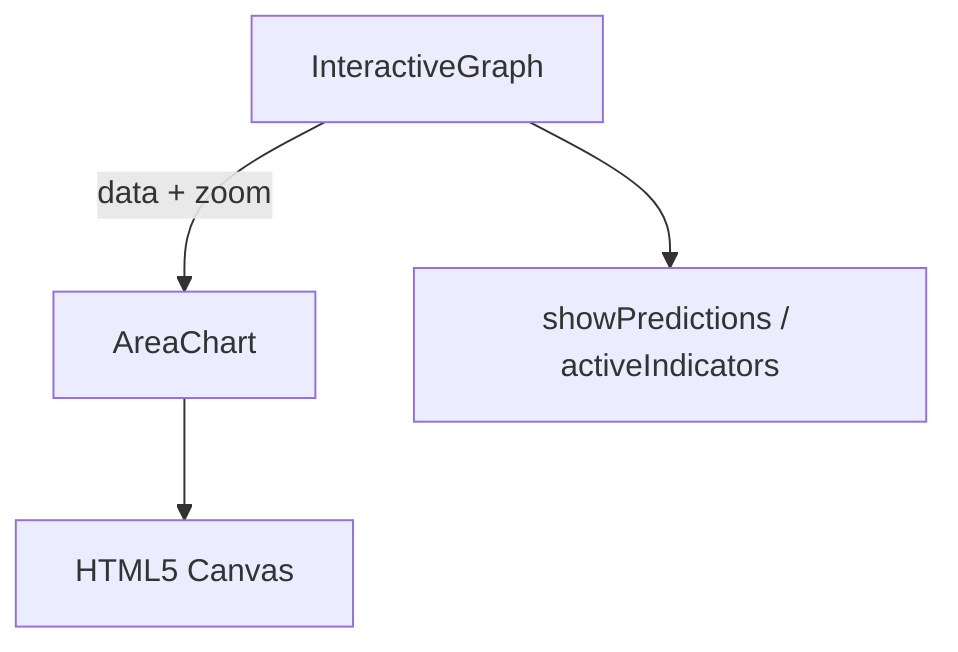
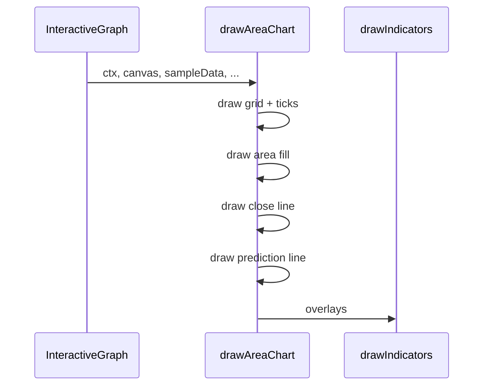
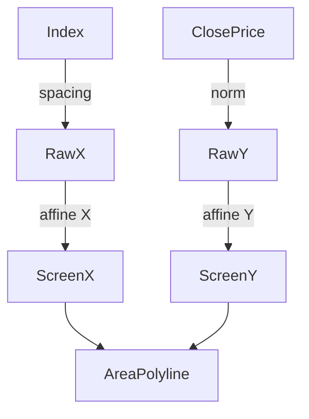

**Purpose:** Render a filled-area price chart that:
- gives an “at-a-glance” sense of cumulative price movement  
- shares grid / zoom / indicator layers with every other chart type  
- lets users compare historical closes to a dashed-violet ML-prediction line  

---

## 🎯 Big-picture design goals  
- **Visual continuity** – area fill inherits the same affine transform as candlesticks and bars, so toggling chart modes never shifts a single pixel.  
- **Focus on closes** – area height maps only the close price, emphasising end-of-interval value (useful for daily snapshots).  
- **Prediction clarity** – dashed violet overlay distinguishes “model future” from “historical reality.”  
- **Indicator compatibility** – calls `drawIndicators()` last so SMA / RSI / etc. appear on top, never hidden by the fill.  

---

## 📐 Sub-system breakdown  

| Stage | What we draw / do               | How we draw / compute                                                         | Concrete UX payoff                             |
|-------|---------------------------------|--------------------------------------------------------------------------------|------------------------------------------------|
| 1 · Grid            | 8 horizontal lines + price labels      | For i=0..8: affine Y → `ctx.stroke()` & `ctx.fillText()`                           | Price anchors (12.5 % bands)                  |
| 2 · Time ticks      | 1 px vertical hairline + MM-DD under each candle | Loop `sampleData`: affine X → tick + text                                           | Temporal orientation                           |
| 3 · Area under close| Cyan alpha fill (`rgba(79,195,247,.18)`) | Polyline of scaled closes + 2 backstop lines → `ctx.fill()`                         | Quick read of accumulated gains/losses         |
| 4 · Close line      | Solid cyan line                       | Same polyline, different stroke → `ctx.stroke()`                                    | Defines precise close value                    |
| 5 · Predictions     | Dashed violet polyline                | Filter `d.is_prediction`, down-sample ≤ 100, `ctx.setLineDash([5,5])` & `ctx.stroke()` | Visualises model output                        |
| 6 · Indicators      | SMA / EMA / …                         | Delegated to `drawIndicators()`                                                     | Consistent overlay layer                       |
| 7 · Zoom affine     | `(coord – center) * zoom + center + offset` on all X/Y | Applied via helper `applyAffineX` / `applyAffineY`                                   | Cursor-centric zoom & pan                      |

---

## ⚙️ Relevant theory / tools  
- **HTML5 Canvas** – immediate-mode, low-overhead drawing  
- **Affine transform** – `(coord – center) * zoom + center + offset`  
- **Linear mapping** – `(close – min)/(max – min) * height` → pixel Y  
- **Down-sampling** – prediction line is clamped to ≤ 100 segments for performance  
- **Alpha compositing** – 0.18 opacity lets grid remain visible through the fill  

---

## 🧮 Algorithm walk-through  

```javascript
// 1️⃣ Grid & ticks (lines 18-49)
ctx.strokeStyle = '#21262d';
for (let i = 0; i <= 8; i++) {
  const y       = padding.top + (i * chartHeight) / 8;
  const scaledY = applyAffineY(y);
  ctx.beginPath();
  ctx.moveTo(padding.left, scaledY);
  ctx.lineTo(padding.left + chartWidth, scaledY);
  ctx.stroke();
  const price = (maxPrice - (i * priceRange) / 8)
    .toLocaleString(undefined, { style: 'currency', currency: 'USD' });
  ctx.fillStyle = '#8b949e';
  ctx.fillText(price, padding.left - 8, scaledY + 3);
}

sampleData.forEach((d, i) => {
  const x       = padding.left + (i * chartWidth) / (sampleData.length - 1);
  const scaledX = applyAffineX(x);
  ctx.beginPath();
  ctx.moveTo(scaledX, applyAffineY(padding.top));
  ctx.lineTo(scaledX, applyAffineY(padding.top + chartHeight));
  ctx.stroke();
  ctx.fillText(typeof d.time === 'string' ? d.time.slice(5) : '', scaledX, canvas.height - 20);
});

// 2️⃣ Area fill (lines 50-72)
ctx.beginPath();
sampleData.forEach((d, i) => {
  const x = padding.left + (i * chartWidth) / (sampleData.length - 1);
  const y = applyAffineY(padding.top + chartHeight - ((d.close - minPrice) / priceRange) * chartHeight);
  ctx.lineTo(x, y);
});
// backstop lines to bottom-right and bottom-left
ctx.lineTo(padding.left + chartWidth, padding.top + chartHeight);
ctx.lineTo(padding.left, padding.top + chartHeight);
ctx.closePath();
ctx.fillStyle = 'rgba(79,195,247,0.18)';
ctx.fill();


// 3️⃣ Close line (lines 73-87)
ctx.beginPath();
ctx.strokeStyle = '#4fc3f7';
ctx.lineWidth   = 2;
sampleData.forEach((d, i) => {
  const x = padding.left + (i * chartWidth) / (sampleData.length - 1);
  const y = applyAffineY(padding.top + chartHeight - ((d.close - minPrice) / priceRange) * chartHeight);
  i === 0 ? ctx.moveTo(x, y) : ctx.lineTo(x, y);
});
ctx.stroke();


// 4️⃣ Prediction overlay (lines 88-118)
ctx.strokeStyle = '#8b5cf6';
ctx.setLineDash([5, 5]);
ctx.beginPath();
const preds = sampleData.filter(d => d.is_prediction);
const step  = Math.max(1, Math.floor(preds.length / 100));
preds.forEach((d, idx) => {
  if (idx % step) return;
  const x  = padding.left + (d.index * chartWidth) / (sampleData.length - 1);
  const y  = applyAffineY(padding.top + chartHeight - ((d.close - minPrice) / priceRange) * chartHeight);
  idx === 0 ? ctx.moveTo(x, y) : ctx.lineTo(x, y);
});
ctx.stroke();
ctx.setLineDash([]);
javascript

// 5️⃣ Indicators (line 119)
drawIndicators(ctx, canvas, sampleData, fullData, activeIndicators, offset, zoom, zoomCenter);
```









```mermaid
classDiagram
  class drawAreaChart {
      <<utility>>
      +drawAreaChart(ctx, canvas, data, fullData, activeIndicators, offset, zoom, zoomCenter)
      -drawGrid()
      -drawTicks()
      -drawArea()
      -drawCloseLine()
      -drawPrediction()
      -applyAffineX(x)
      -applyAffineY(y)
  }
