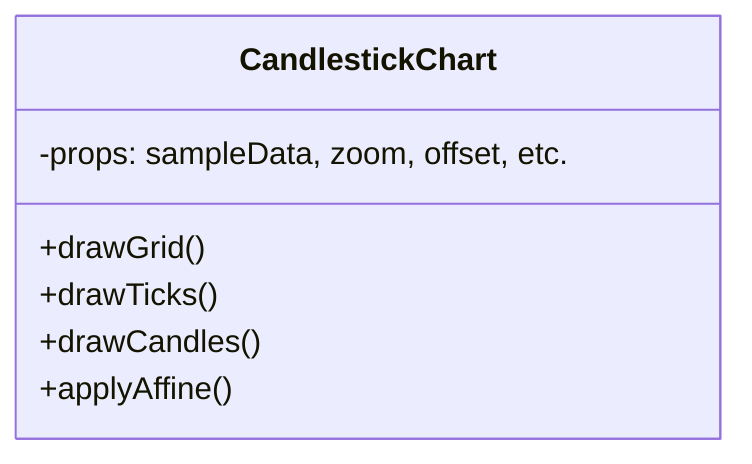

<div dir="ltr">

> Purpose:**Convert raw OHLCV arrays into a high-precision, zoomable financial chart  displaying grid lines, time ticks, candlesticks, and prediction overlays via HTML5 Canvas**

</div>
---

**Big-picture architecture**

**Mission**

This component visually encodes price movements so users can read:

- **Support/resistance levels** via grid segmentation
- **Time context** with consistent ticks and labels
- **Market behavior** with candlestick direction
- **Zoom/pan interactivity** through affine transforms

---

 **Relevant Technologies & Theory**

| Concept | Tool | Description |
|--------|------|-------------|
| Chart rendering | **HTML5 Canvas** | Immediate-mode vector drawing API used for full control over pixels |
| Data transform | **Affine transformation** | Core math to handle zoom/pan: `(raw - center) * zoom + center + offset` |
| Data mapping | **Linear normalization** | Mapping open/high/low/close to Y-space via `(value - min) / range` |
| UX styling | **WCAG-compliant colors** | Neutral greys, bull-green `#238636`, bear-red `#da3633` |
| React props | `sampleData`, `zoom`, `offset` | Passed from parent `InteractiveGraph` container |
| Prediction segmentation | `is_future` | Future data visually distinguished from historical data |

---

**Overview of Subsystems**

| Stage | What we draw | How we draw it | Why it matters (UX payoff) |
|-------|--------------|----------------|-----------------------------|
| **1** ֲ· Grid | 8 horizontal lines & price labels | Loop 0..8, compute rawY ג†’ apply affine ג†’ draw line & text | Users estimate ג€œhow far are we from $X?ג€ quickly |
| **2** ֲ· Time ticks | 1px hairline + `MM-DD` under each candle | Loop data[], compute scaledX, draw tick & label | Temporal awareness without tooltips |
| **3** ֲ· Candlesticks | Wick + body for each historical data point | Map OHLC to scaledY, draw body w/ green/red | Candles encode direction & volatility |
| **4** ֲ· Zoom | Apply single affine formula on every coord | `(raw - center) * zoom + center + offset` | Feels like Bloomberg/TradingView |

---

**Core Algorithm Walkthrough**

**Part 1: Drawing the Grid**

```js
ctx.strokeStyle = '#21262d';
ctx.lineWidth = 1;
for (let i = 0; i <= 8; i++) {
  const y = padding.top + (i * chartHeight) / 8;
  const scaledY = (y - zoomCenter.y) * zoom + zoomCenter.y + offset.y;
  ctx.beginPath();
  ctx.moveTo(padding.left, scaledY);
  ctx.lineTo(padding.left + chartWidth, scaledY);
  ctx.stroke();
  const price = maxPrice - (i * priceRange) / 8;
  ctx.fillStyle = '#8b949e';
  ctx.font = '11px Segoe UI';
  ctx.textAlign = 'right';
  ctx.fillText(`$${price.toLocaleString()}`, padding.left - 8, scaledY + 3);
}
```

**Why it matters**
This segment evenly splits the chart into price bands (12.5% each), providing crucial reference points. The affine ensures zoom centering holds, improving navigation consistency.

---

**CandlestickChart Overview**



---

**CandlestickChart Overview**
**Role in Project**
This file turns numeric arrays into **visual intelligence** for traders and analysts.

It ensures clarity, accessibility, and UX excellence ג€” supporting overlays, predictions, tooltips, and ML enhancements that build on top.

---

