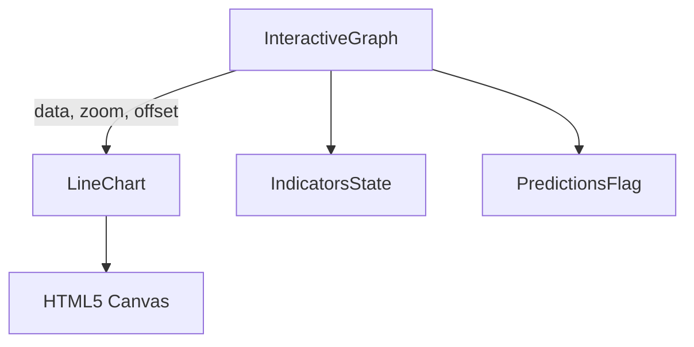
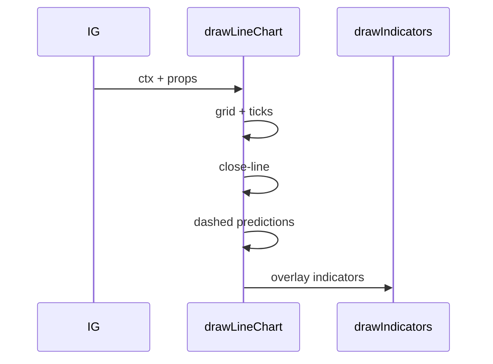
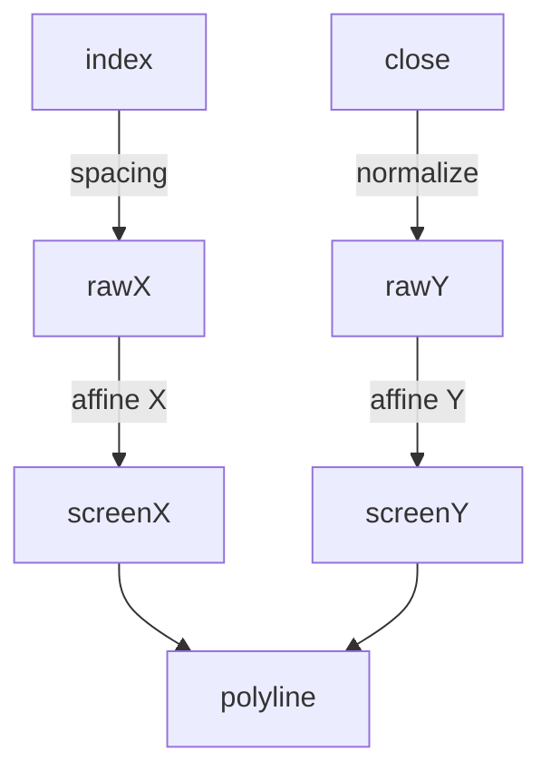

# `UI/src/charts/drawLineChart.js`

🔍 **Purpose:** Render a classic close-price line chart that shares the exact grid, zoom/pan mechanics, prediction overlay, and indicator layer used by the candlestick, bar, and area views. Ideal for traders who prefer a clean signal (close-only) without candle noise.

---

## 🎯 Big-picture goals  
- **Clarity** – one solid cyan line traces the close; no fill, no distraction.  
- **Pixel-perfect parity** – every X/Y coordinate is generated with the same affine transform as the other chart modes, so toggling views never shifts alignment.  
- **Future vs. Past** – dashed violet prediction line clearly marks model output while sharing axes with historical data.  
- **Indicator overlay** – SMA / EMA / RSI etc. must sit on top of the line, drawn last via `drawIndicators()`.

---

## 📐 Sub-system breakdown  

| Stage              | What we draw / do                         | Implementation highlight                                         | UX payoff                                    |
|--------------------|-------------------------------------------|------------------------------------------------------------------|-----------------------------------------------|
| **1 • Grid**       | 8 horizontal guide-lines + price labels   | Loop i=0..8, affine Y, `stroke()` + `fillText()`                 | Price anchors every 12.5 %                    |
| **2 • Time ticks** | 1 px vertical hairline + MM-DD per candle | Loop `sampleData`: affine X, `stroke()`, label                    | Temporal reference without tool-tip           |
| **3 • Close line** | Solid cyan path through closes            | One `beginPath()` → `lineTo` loop → `stroke()`                   | Clean, minimal trend signal                   |
| **4 • Prediction** | Dashed violet polyline                    | Filter `is_prediction`, down-sample ≤ 100, `setLineDash([5,5])`  | Distinct “future” insight                     |
| **5 • Indicators** | SMA / EMA / …                              | Delegate to `drawIndicators()`                                   | Consistent styling with all chart types       |
| **6 • Affine X/Y** | `(coord − center)*zoom + center + offset` | Applied by helpers for every X/Y                                 | Cursor-centric zoom/pan feel                  |

---

## ⚙️ Theory & tools  

| Concept             | In this file                                                  |
|---------------------|----------------------------------------------------------------|
| HTML5 Canvas        | Immediate-mode drawing at 60 fps                               |
| Affine transforms   | Keeps grid/line/predictions aligned while zooming             |
| Linear mapping      | `(price − min)/(max − min) × chartHeight`                     |
| Down-sampling       | Ensures prediction line never exceeds 100 points               |
| WCAG colours        | Cyan `#4fc3f7` (AA on dark), violet `#8b5cf6` dashed for model |

---

## 🧮 Deep algorithm walk-through

### Part 1 – Grid & price labels (lines 18–35)

```javascript
ctx.strokeStyle = '#21262d';
ctx.lineWidth   = 1;
for (let i = 0; i <= 8; i++) {
  const y       = padding.top + (i * chartHeight) / 8;        // (a) raw Y
  const scaledY = (y - zoomCenter.y) * zoom + zoomCenter.y + offset.y; // (b) affine
  ctx.beginPath();
  ctx.moveTo(padding.left, scaledY);
  ctx.lineTo(padding.left + chartWidth, scaledY);
  ctx.stroke();

  const price = maxPrice - (i * priceRange) / 8;               // (c) label value
  ctx.fillStyle = '#8b949e';
  ctx.font      = '11px Segoe UI';
  ctx.textAlign = 'right';
  ctx.fillText(`$${price.toLocaleString()}`, padding.left - 8, scaledY + 3);
}
```
(a) Raw Y divides the drawable region into equal 12.5 % slices.
(b) Affine transform keeps grid locked to mouse-centric zoom.
(c) Label formula subtracts i slices from maxPrice; ensures top label is always the highest visible tick even after zoom.

UX impact: Without these price anchors, users lose absolute sense of “how high is this peak?” especially when zoomed.
**Part 2–Time ticks & dates(lines 36–53)**
```javascript
sampleData.forEach((d, i) => {
  const x        = padding.left + (i * chartWidth) / (sampleData.length - 1); // raw X
  const scaledX  = (x - zoomCenter.x) * zoom + zoomCenter.x + offset.x;       // affine X
  const scaledY0 = (padding.top - zoomCenter.y) * zoom + zoomCenter.y + offset.y;
  const scaledY1 = (padding.top + chartHeight - zoomCenter.y) * zoom + zoomCenter.y + offset.y;

  ctx.beginPath();          // vertical hairline
  ctx.moveTo(scaledX, scaledY0);
  ctx.lineTo(scaledX, scaledY1);
  ctx.stroke();

  ctx.fillStyle = '#8b949e'; // `MM-DD`
  ctx.font      = '10px Segoe UI';
  ctx.textAlign = 'center';
  ctx.fillText(d.time?.slice(5) || '', scaledX, canvas.height - 20);
});
```
Even spacing: i / (N−1) ensures each candle—even missing dates—gets a tick.

Two affine Y coords: prevents skew when zoomed (hairline is full-height).

Date slice: slice(5) gives compact MM-DD, preserves legibility.

**Part 3 – Close line (lines 54–73)**
```javascript
ctx.strokeStyle = '#4fc3f7';
ctx.lineWidth   = 2;
ctx.beginPath();
sampleData.forEach((d, i) => {
  if (typeof d.close !== 'number') return;
  const x  = padding.left + (i * chartWidth) / (sampleData.length - 1);
  const sx = (x - zoomCenter.x) * zoom + zoomCenter.x + offset.x;
  const y  = padding.top + chartHeight - ((d.close - minPrice) / priceRange) * chartHeight;
  const sy = (y - zoomCenter.y) * zoom + zoomCenter.y + offset.y;
  if (i === 0) ctx.moveTo(sx, sy);
  else         ctx.lineTo(sx, sy);
});
ctx.stroke();
```
Why close-only? It’s the de-facto reference in EOD data; removes noise from intra-candle volatility.

Line width 2: balances visibility and subtlety when indicators overlay.

Pixel rounding: Canvas anti-aliases sub-pixel coords → crisp line.

**Part 4 – Prediction overlay (lines 74–109)**
```javascript
const predictionData = sampleData.filter(d => d.predicted_close && d.is_prediction);
if (predictionData.length > 100) {
  // down-sample to ≤ 100
}
ctx.strokeStyle = '#8b5cf6';
ctx.lineWidth   = 3;
ctx.setLineDash([5, 5]);
ctx.beginPath();
let first = true;
predictionData.forEach(d => {
  const idx = sampleData.indexOf(d);
  if (idx === -1) return;
  const sx = /* affine X */;
  const sy = /* affine Y (predicted_close) */;
  if (first) {
    ctx.moveTo(sx, sy);
    first = false;
  } else {
    ctx.lineTo(sx, sy);
  }
});
ctx.stroke();
ctx.setLineDash([]);
```
Dash pattern [5,5]: 5 px dashes & gaps → unmistakably “forecast.”

Down-sampling strategy: fixed-step pick + always append last point avoids jagged clipping when zoomed out.

Colour semantics: violet sits outside the price bull/bear palette.

**Part 5 – Indicator overlay (line 110)**
```javascript
drawIndicators(ctx, canvas, sampleData, fullData, activeIndicators, offset, zoom, zoomCenter);
```
Why last? Ensures moving-average lines aren’t hidden behind the cyan price line.
```











```mermaid
classDiagram
  class drawLineChart {
    +drawLineChart(ctx, canvas, sampleData, fullData, activeIndicators, offset, zoom, zoomCenter)
    -drawGrid()
    -drawTicks()
    -drawCloseLine()
    -drawPredictionLine()
    -applyAffineX(x)
    -applyAffineY(y)
  }

Shared helper: keeps colour palette, down-sampling, and sub-pane offsets identical across chart modes.
