# `UI/src/charts/drawBarChart.js`

🔍 **Purpose:** Render a volume-style bar chart that plots the close price of every candle, overlays ML predictions, and honours zoom / pan / indicator layers shared with the rest of the charting system.

---

## Big-picture mission  
Turn the same OHLCV array used by the candlestick/line/area renderers into a retina-sharp, zoomable bar chart so users can:  
- see closing-price momentum at a glance  
- compare historical bars vs. predicted close values (dashed violet)  
- keep every pixel perfectly aligned with the shared grid and tooltip logic

| Stage | What we draw / do                         | How we draw / compute                                                         | Why it matters (user payoff)                             |
|-------|-------------------------------------------|--------------------------------------------------------------------------------|----------------------------------------------------------|
| 1     | Grid                                      | Eight horizontal guide-lines + price labels<br>Loop 0–8 → affine transform → `ctx.stroke()` & `ctx.fillText()` | Spatial anchor for price context (12.5 % steps)          |
| 2     | Time ticks                                | 1 px vertical hair-line per candle + MM-DD label<br>Iterate `sampleData` → `scaledX` → tick + text | Temporal orientation without needing tool-tips           |
| 3     | Close-price bars                          | Filled rectangle per candle, width ≤ 20 px<br>Map close→pixel-Y; height = `chartHeight – closeY` | Immediate perception of upward/downward momentum         |
| 4     | Prediction overlay                        | Dashed violet line connecting predicted closes<br>Filter `d.is_prediction` → down-sample → polyline (`ctx.setLineDash`) | Visually separates model output from ground-truth        |
| 5     | Indicators                                | SMA / RSI / … drawn over bars<br>Delegates to shared `drawIndicators()` util   | Consistent indicator layer across all chart types        |
| 6     | Zoom-aware affine                         | `(coord – center) * zoom + center + offset` on every X/Y                       | Feels like TradingView-grade interaction (cursor-centred zoom & smooth panning) |

---

## 💡 Design goals & UX reasoning
- **Zero visual drift.** Grid, ticks, bars, predictions, and indicators share the exact affine transform so they remain locked together while zooming or panning.  
- **Size-adaptive bars.** `barWidth = min(chartWidth/N * 0.6, 20)` ensures bars never exceed 20 px (prevents overlap) and remain visible when zoomed far out.  
- **Colour semantics.** Bars are cyan `#4fc3f7` to avoid confusing them with candlestick green/red; predictions are violet `#8b5cf6` and dashed to imply uncertainty.

---

## 🧮 Step-by-step algorithm

```js
// 1. Canvas reset
ctx.fillStyle = '#0d1117';
ctx.fillRect(0, 0, canvas.width, canvas.height);
// Wipes any previous frame, crucial when switching chart types

// 2. Scaling maths
const allValues  = sampleData.map(d => d.close);
const minPrice   = Math.min(...allValues) * 0.9995;
const maxPrice   = Math.max(...allValues) * 1.0005;
const priceRange = maxPrice - minPrice;
// Adds ±0.05% head-room so bars never touch grid border

// 3. Grid + price labels
ctx.strokeStyle = '#21262d';
ctx.lineWidth   = 1;
ctx.fillStyle   = '#8b949e';
ctx.font        = '11px Segoe UI';
ctx.textAlign   = 'right';

for (let i = 0; i <= 8; i++) {
  const y       = padding.top + (i * chartHeight) / 8;
  const scaledY = applyAffineY(y);
  ctx.beginPath();
  ctx.moveTo(padding.left, scaledY);
  ctx.lineTo(padding.left + chartWidth, scaledY);
  ctx.stroke();
  const price = (maxPrice - (i * priceRange) / 8)
    .toLocaleString(undefined, { style: 'currency', currency: 'USD' });
  ctx.fillText(price, padding.left - 8, scaledY + 3);
}

// 4. Time ticks + dates
ctx.strokeStyle = '#8b949e';
ctx.font        = '10px Segoe UI';
ctx.textAlign   = 'center';

sampleData.forEach((d, i) => {
  const x       = padding.left + (i * chartWidth) / (sampleData.length - 1);
  const scaledX = applyAffineX(x);
  const topY    = applyAffineY(padding.top);
  const botY    = applyAffineY(padding.top + chartHeight);

  ctx.beginPath();
  ctx.moveTo(scaledX, topY);
  ctx.lineTo(scaledX, botY);
  ctx.stroke();

  const label = typeof d.time === 'string' ? d.time.slice(5) : '';
  ctx.fillText(label, scaledX, canvas.height - 20);
});

// 5. Close-price bars
ctx.fillStyle = '#4fc3f7';

sampleData.forEach((d, i) => {
  if (typeof d.close !== 'number') return;
  const x         = padding.left + (i * chartWidth) / (sampleData.length - 1);
  const scaledX   = applyAffineX(x);
  const rawY      = padding.top + chartHeight - ((d.close - minPrice) / priceRange) * chartHeight;
  const scaledY   = applyAffineY(rawY);
  const rawH      = chartHeight - ((d.close - minPrice) / priceRange) * chartHeight;
  const scaledH   = rawH * zoom;
  ctx.fillRect(scaledX - barWidth / 2, scaledY, barWidth, scaledH);
});

// 6. Prediction overlay
ctx.strokeStyle = '#8b5cf6';
ctx.setLineDash([4, 2]);
ctx.beginPath();

const preds = sampleData.filter(d => d.is_prediction);
const step  = Math.max(1, Math.floor(preds.length / 100));
preds.forEach((d, idx) => {
  if (idx % step) return;
  const x  = padding.left + (d.index * chartWidth) / (sampleData.length - 1);
  const y  = padding.top + chartHeight - ((d.close - minPrice) / priceRange) * chartHeight;
  const sx = applyAffineX(x);
  const sy = applyAffineY(y);
  idx === 0 ? ctx.moveTo(sx, sy) : ctx.lineTo(sx, sy);
});
ctx.stroke();
ctx.setLineDash([]);

// 7. Indicators
drawIndicators(ctx, canvas, sampleData, zoom, offset);
```

```mermaid
sequenceDiagram
    participant IG as InteractiveGraph
    participant BC as drawBarChart
    participant IND as drawIndicators

    IG->>BC: ctx, canvas, data, zoom, offset
    BC->>BC: draw grid / ticks
    BC->>BC: draw bars + predictions
    BC->>IND: drawIndicators(...)
    IND-->>BC: ✓
    BC-->>Canvas: pixels
```

```mermaid
flowchart TD
    PriceData --> |linear norm| Ypos
    Ypos --> |apply zoom + pan| ScreenY
    Index --> |index→x mapping| Xraw
    Xraw --> |affine| ScreenX
    ScreenX & ScreenY --> BarRect
```




```mermaid
