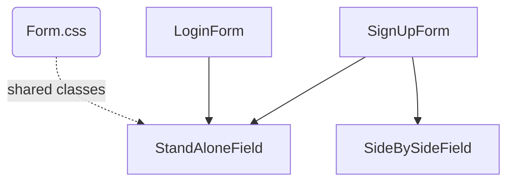
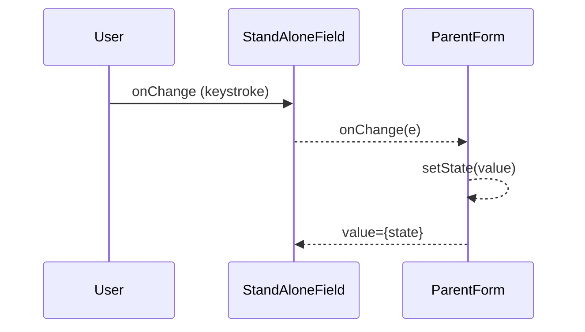
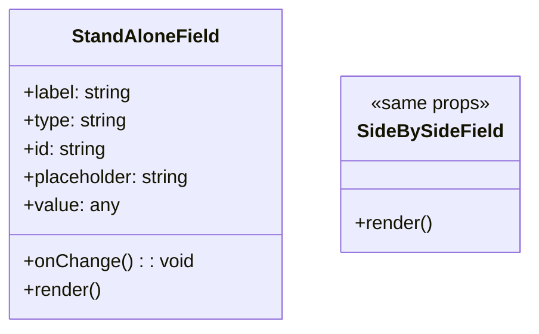
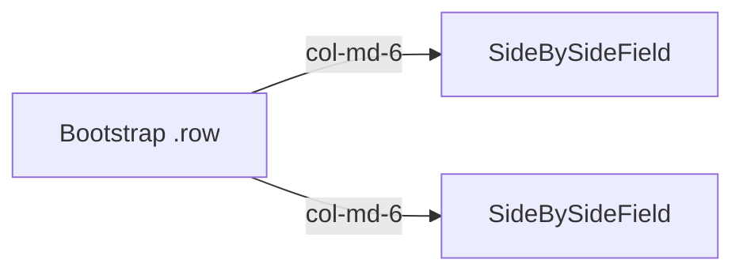

## Purpose
Two ultra-light React components that keep all authentication & profile pages consistent:

| Component           | Renders                                    | Typical Use Case                     |
|---------------------|--------------------------------------------|--------------------------------------|
| **StandAloneField** | Full-width `<input>` row (`col-12`)        | Username, Email, Phone, Location     |
| **SideBySideField** | Half-width `<input>` (`col-6`) beside a sibling | Password & Confirm Password pair  |

By abstracting the `<label>` + `<input>` markup (including Bootstrap classes), we avoid repetitive boilerplate and guarantee identical spacing/font weights across Login, Sign-Up, and any future settings forms.

---

## 🎯 Big-picture Goals

| Goal              | Implementation Detail                        | Benefit                                   |
|-------------------|----------------------------------------------|-------------------------------------------|
| DRY markup        | 2 tiny React components (≤15 lines each)     | Cleaner parent forms                      |
| Bootstrap grid    | `col-md-6` vs `col-mb-12`                    | Perfect alignment on all breakpoints      |
| Native validation | Built-in `required` attribute                | Browsers auto-prevent empty submits       |
| Prop-driven       | `value` + `onChange` passed from parent      | Controlled inputs, no internal state      |
| Accessibility     | `label htmlFor={id}` ties label & input      | Screen-reader friendly                    |

---

## 🧮 Code Walk-through

### StandAloneField
```jsx
export function StandAloneField({ label, type, id, placeholder, value, onChange }) {
  return (
    <div className="col-mb-12">               {/* full-width on mobile */}
      <label htmlFor={id} className="form-label">
        {label}
      </label>
      <input
        type={type}                           {/* text / email / password … */}
        id={id}
        className="form-control form-box"
        value={value}                         {/* parent-controlled */}
        placeholder={placeholder}
        onChange={onChange}
        required                              {/* native HTML5 “required” */}
      />
    </div>
  );
}
```
SideBySideField
Identical to StandAloneField except:

Container uses className="col-md-6"

Input uses className="form-control form-small-box"

```jsx
export function SideBySideField(props) {
  return (
    <div className="col-md-6">
      <label htmlFor={props.id} className="form-label">
        {props.label}
      </label>
      <input
        {...props}
        className="form-control form-small-box"
        required
      />
    </div>
  );
}
```






🏆 Impact on the Project
Speed of form creation: New pages need only one-liners instead of verbose label/input markup.

Uniform look & feel: Any CSS tweak to .form-box propagates everywhere.

Accessibility guarantee: Labels correctly bound to inputs via htmlFor.

Error-state styling: Parents can wrap these components with validation logic without changing internals.

Copy
Edit
