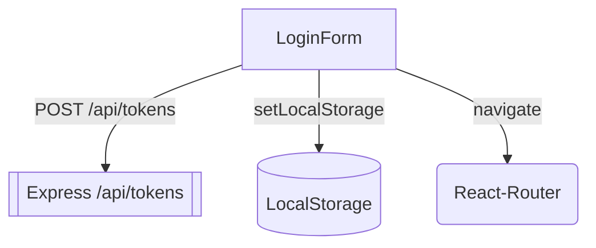
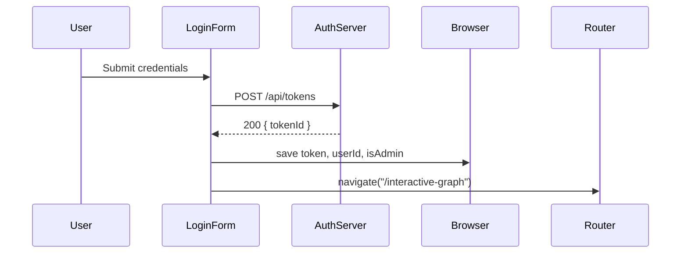
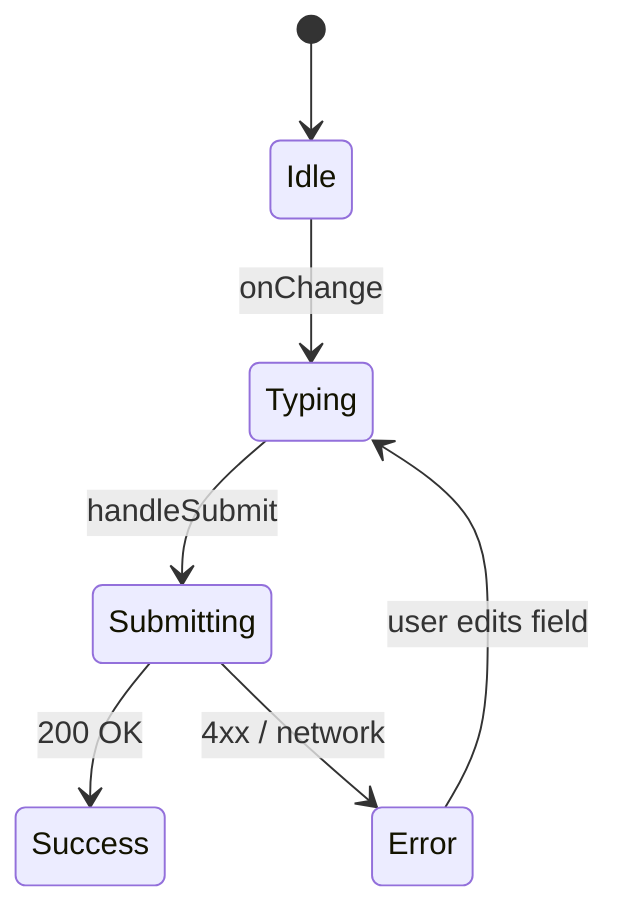
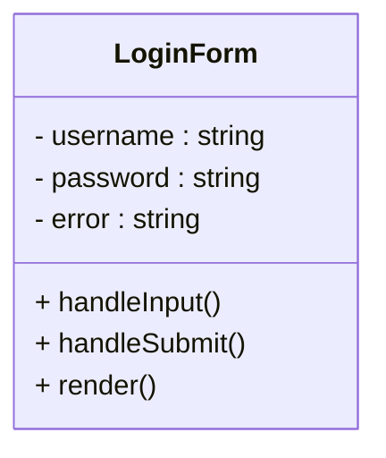

## Purpose
Handle user authentication for the trading-dashboard front-end:
- Collect credentials  
- POST to `/api/tokens`  
- Persist JWT and user-profile fields  
- Redirect to Interactive Graph on success  

---

## 🎯 Big-picture UX & Security Goals

| Goal                   | Implementation Detail                                                   | Benefit                                           |
|------------------------|-------------------------------------------------------------------------|---------------------------------------------------|
| Minimal friction       | Two fields (`username` + `password`) and a single **Sign in** button    | Fast login, no extra MFA simulation (optional)    |
| Server-side auth       | `fetch(\`${backendUrl}api/tokens\`, { method: 'POST', … })`            | Front-end never stores raw passwords              |
| JWT persistence        | `localStorage.setItem('authToken', …)`                                  | Durable token across tab refreshes                |
| Role awareness         | `isAdmin` flag cached → admin UI toggles                               | Single endpoint for both retail and admin users   |
| Friendly error handling| `setError('Invalid credentials')` or network error                     | Clear feedback, no silent failures                |
| Responsive & accessible| Bootstrap-like `.row`, `.form-control`, 44 px buttons                  | Works on desktop, tablet, keyboard navigation     |
| Branding consistency   | Netflix-red primary button (`btn btn-danger`)                            | Cohesive look across pages                        |
| Route-level guard      | `navigate('/interactive-graph')`                                         | Prevents unauthenticated access                   |

---

## ⚙️ Relevant Theory / Tools

| Topic          | How It’s Used                                              |
|----------------|------------------------------------------------------------|
| React hooks    | `useState` for form state; `useNavigate` for redirect      |
| Fetch API      | Native promise-based HTTP POST                             |
| REST endpoint  | `POST /api/tokens` returns `{ tokenId: { token, userId, isAdmin } }` |
| LocalStorage   | Durable storage for JWT                                    |
| Bootstrap      | Utility classes: `.row`, `.col-12`, `.btn`, `.form-control`|
| CSS            | Inline `pageStyle` + `Form.css` for inputs                 |

---


### 1. Controlled Inputs
```jsx
const [username, setUsername] = useState('');
const [password, setPassword] = useState('');
const handleInput = setter => e => {
  setError('');            // clear previous error
  setter(e.target.value);  // update corresponding state
};
```
Guarantees UI and React state are always in sync.

2. Form Submission
```jsx
const handleSubmit = async e => {
  e.preventDefault();                     
  if (!username || !password) {
    setError('Please fill in all fields');
    return;
  }

  try {
    const response = await fetch(`${backendUrl}api/tokens`, {
      method: 'POST',
      headers: { 'Content-Type': 'application/json' },
      body: JSON.stringify({ username, password })
    });

    if (response.ok) {
      const data = await response.json();
      localStorage.setItem('authToken', data.tokenId.token);
      localStorage.setItem('userId',    data.tokenId.userId);
      localStorage.setItem('isAdmin',   data.tokenId.isAdmin);
      navigate('/interactive-graph');
    } else {
      setError('Invalid credentials');
    }
  } catch (err) {
    setError('Network error, please try again');
  }
};
```
3. Background Hero Style
```jsx
const pageStyle = {
  backgroundImage: `url(${process.env.PUBLIC_URL}/images/background.jpg)`,
  backgroundSize: 'cover',
  minHeight: '100vh'
};
```
Uses CRA’s public/images/ folder → no bundler import required.

4. Error Splash
```jsx
{error && <div className="alert alert-danger">{error}</div>}
```
Styled via .alert in Form.css.







🏆 Contribution to Project
Entry Gate: Only authenticated users reach charts & analytics

Role Propagation: isAdmin toggles admin routes

Stateless Back-end: JWT auth enables horizontal scaling

Brand Experience: Netflix-inspired styling aligns with theme
