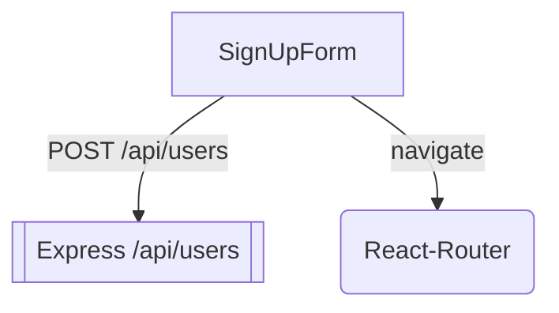
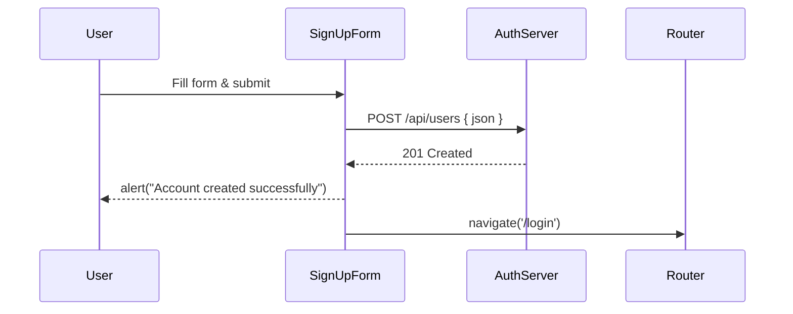
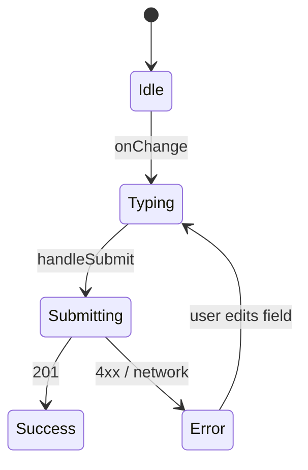
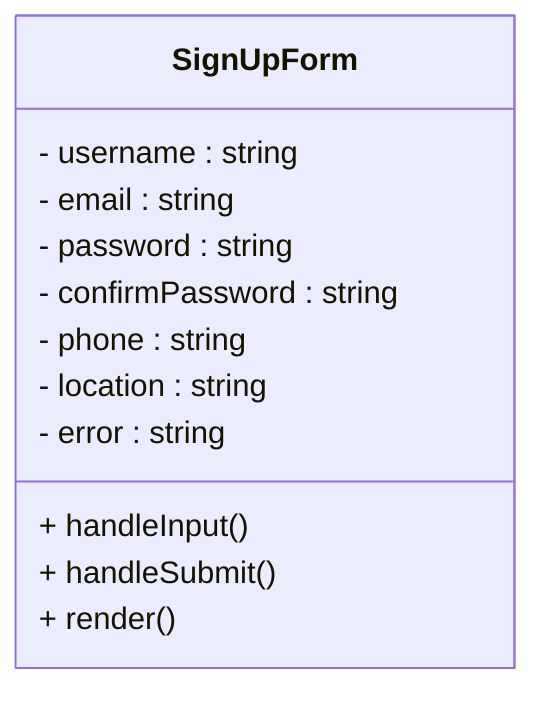

## Purpose
Client-side “Create Account” form that:
- Collects `username`, `email`, `password`, `confirmPassword`, `phone`, and `location`
- Validates fields in-browser (non-empty, password match, length ≥ 8)
- POSTs JSON payload to `POST /api/users` on the Node/Express back-end
- Routes the user to the **Login** page on success

---

## 🎯 Big-picture UX & Security Goals

| Goal                  | Implementation Detail                                                                              | User Benefit                       |
|-----------------------|----------------------------------------------------------------------------------------------------|------------------------------------|
| Quick sign-up         | Only 6 fields; instant inline errors                                                               | ↓ friction                         |
| Early error detection | Client validation before network                                                                  | Saves round-trip latency           |
| Strong password       | `password.length >= 8` check                                                                      | Basic security hygiene             |
| Safe creds transport  | `fetch(..., { method: 'POST', headers: { 'Content-Type':'application/json' }})` over HTTPS/TLS     | Secure transmission                |
| Friendly failures     | `setError()` + red alert                                                                           | Clear guidance                     |
| Brand consistency     | Netflix-style red button / dark hero background                                                    | Cohesive look                      |
| Accessible nav        | `<Link to="/">` + large back arrow                                                                | Keyboard & screen-reader friendly  |

---


### 1️⃣ Controlled-input Helper
```jsx
const handleInput = setter => e => {
  setError('');
  setter(e.target.value);
};
Resets errors on each edit to prevent stale warnings
```
2️⃣ Validation Chain in handleSubmit
```jsx
if (!username || !email || !password ||
    !confirmPassword || !phone || !location) {
  setError('Please fill in all fields');
  return;
}
if (password !== confirmPassword) {
  setError('Passwords do not match');
  return;
}
if (password.length < 8) {
  setError('Password must be at least 8 characters long');
  return;
}
```
Sequential guards keep logic simple; exit on first failure

3️⃣ Constructing userData
```jsx
const userData = { username, email, password, phone, location };
```
Phone stored as plain string; location free-text for now

4️⃣ POST to Back-end
```jsx
const response = await fetch(`${backendUrl}users`, {
  method: 'POST',
  headers: { 'Content-Type':'application/json' },
  body: JSON.stringify(userData)
});
```
Expects 201 Created or JSON { error: "…" }

5️⃣ Success ➔ Redirect
```jsx
alert('Account created successfully');
navigate('/login');
```
No token stored; next step is login flow






🖌️ UI Composition

Field components:

StandAloneField for full-row inputs with labels

SideBySideField for Password & Confirm side by side

Buttons: .btn-danger (red) using shared CSS

Back arrow: <i className="bi bi-arrow-left"/> top-left, hover scale 1.35

🏆 Contribution to Project
Provides on-ramp for new users, populating the MongoDB users collection

Enforces baseline password strength client-side; server will hash & salt

Captures phone & location for future risk-profile or KYC features

Seamless redirect to login maintains narrative flow
