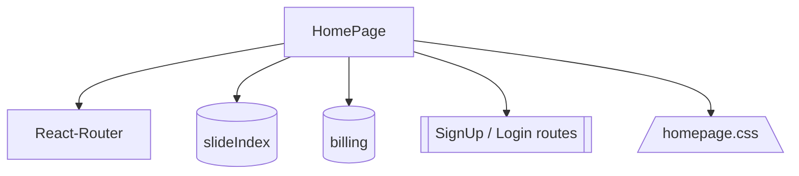
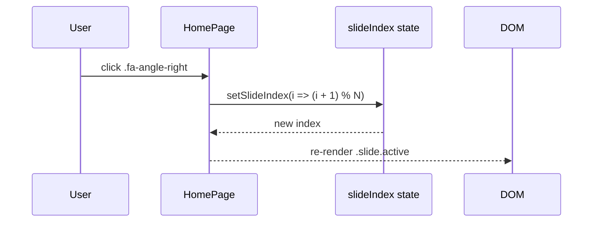
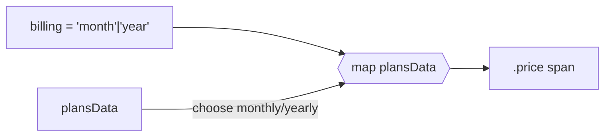
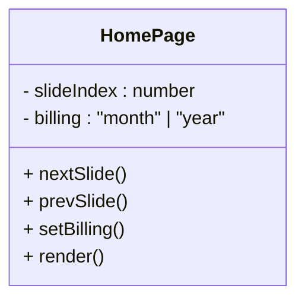

## Purpose
Acts as the marketing/onboarding landing page for the entire E-Stock application. Blends static storytelling (header, hero, feature grid) with interactive logic (slider, pricing toggle, navigation) to funnel visitors into the sign-up or log-in flow.

---

## 1️⃣ Big-Picture Design Goals

| Goal                   | Concretely Implemented By                                              | UX / Business Payoff                                     |
|------------------------|------------------------------------------------------------------------|----------------------------------------------------------|
| Immediate trust        | Dark “fin-tech” palette, hero graphic, Font Awesome icons              | First-time visitors grasp brand tone in seconds          |
| Clear calls-to-action  | Header “Sign Up” button, hero “Start Trading” link, nav “Login”        | Higher conversion into auth flow                         |
| Social proof           | Rotating testimonials slider (`slidesData`)                            | Reduces perceived risk                                   |
| Value differentiation  | “Services” grid + “Benefits we offer” copy                             | Showcases product scope                                  |
| Transparent pricing    | Toggle between monthly/yearly billing state                            | Lets users price-anchor                                  |
| Global responsiveness  | Pure CSS + `@media` queries — no JS breakpoints                        | Mobile-first integrity                                   |
| SEO / a11y baseline    | Semantic `<header>`, `<nav>`, `<footer>` + headings                    | Indexing & screen-reader friendliness                    |

---

## 2️⃣ Sub-System Breakdown

| #  | Sub-system             | Key Code                    | How It Works                                    | Why It Matters                          |
|----|------------------------|-----------------------------|-------------------------------------------------|-----------------------------------------|
| 1  | Header / Nav           | `<header>` + sticky CSS     | `position: sticky;` + `box-shadow`              | Brand anchor + quick links              |
| 2  | Hero (“Home”)          | Flex row + `top.png`        | CSS animations (`animate1`/`animate2`)          | Eye-catch; conveys modern polish        |
| 3  | Testimonials slider    | `slideIndex` state + `nextSlide` / `prevSlide` | `(i ± 1) % length` cyclic iterator, active class | Lightweight carousel without package    |
| 4  | Pricing cards          | `plansData` + billing toggle | Conditional render of monthly vs yearly strings | Reduces card duplication                |
| 5  | Routing CTAs           | `useNavigate()`             | Programmatic redirects on clicks                | SPA continuity, zero full-page reload   |
| 6  | CSS theme              | `homepage.css` variables + keyframes | Centralized color system + animations         | Consistency & easy theming              |

---


### a) Cyclic Testimonial Slider
```jsx
const nextSlide = () =>
  setSlideIndex(i => (i + 1) % slidesData.length);

const prevSlide = () =>
  setSlideIndex(i => (i - 1 + slidesData.length) % slidesData.length);
```
Why modulus?
Prevents overflow/underflow by wrapping index 0 ⇄ N-1

Immutability:
Functional setState guarantees correctness during React batching

b) Billing Toggle
```jsx
<div
  onClick={() => setBilling('month')}
  className={`button month-btn ${billing === 'month' ? 'active' : ''}`}
>
  Monthly
</div>
```
Single source of truth: billing string drives CSS highlight and price text

Side-effect free: no extra recalculation needed

c) Navigation to Auth Routes
```jsx
<a
  onClick={() => navigate('signup')}
  className="btn"
>
  Sign Up Now
</a>
```
Uses SPA routing (useNavigate), avoids full page reload, preserves app state







5️⃣ CSS Architecture Highlights (homepage.css)
Design tokens: :root custom-props (--bg-color, --gradient) for easy theming

Keyframes: animate1 / animate2 drive subtle vertical sweeps beside hero image

Pure-CSS carousel pause:
.brands:hover .brands-container {
  animation-play-state: paused;
}
Mobile nav: Media query switches to icon-only nav at <768px

6️⃣ How This Page Fits the Project
Traffic entry point at /
Converts leads → /signup or /login, populating user base for /interactive-graph
Shares theme variables with chart UI for brand continuity
Demonstrates React-Router and hooks patterns.

