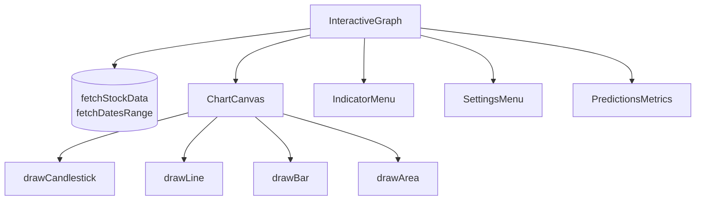
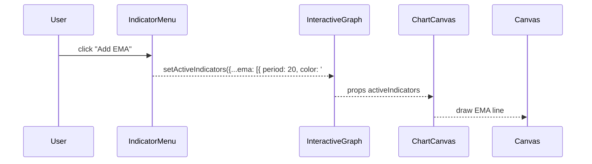
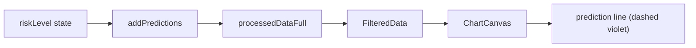
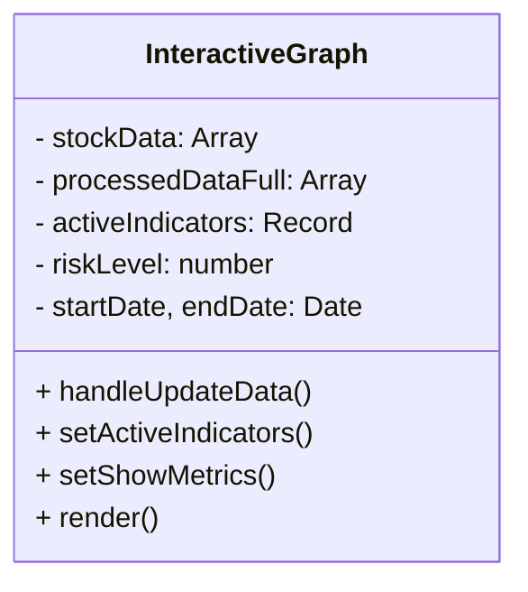

## Purpose
Renders the heart of the trading dashboard: an interactive, zoom-able, indicator-rich chart + control surface wrapped in a single React page. It orchestrates data fetch, technical-indicator state, date & risk sliders, prediction metrics, tooltip/legend overlays, and multiple chart engines (candlestick / line / bar / area).

---

## 1 · Big-Picture Design & UX Goals

| 🎯 Goal                   | What Ships It                                               | Concrete Payoff                        |
|---------------------------|-------------------------------------------------------------|----------------------------------------|
| Focus on price-action     | `<ChartCanvas/>` with full-viewport canvas & grab-to-drag UX | Traders see max data per pixel         |
| 1-click settings          | Floating `<SettingsButton/>` → `<SettingsMenu/>`            | Compact controls on small screens      |
| Zero-setup indicators     | `<IndicatorMenu>` state machine (SMA, EMA, RSI, …)          | Education-friendly tinkering           |
| Predictions transparency  | Risk slider (1–9) → thresholds + `<PredictionsMetrics/>`    | Quantifies model quality live          |
| Accessible dark theme     | CSS vars & `prefers-contrast` in `InteractiveGraph.css`     | WCAG AA basics out-of-box              |
| Adaptive performance      | `MAX_CANDLES` guard + down-sampling branch                  | Fluid 60 FPS even on big time-ranges   |
| SPA data freshness        | “Update Data” async button (calls `/updateDates`)           | User never wonders “is this stale?”    |

---

## 2 · Subsystem Map

| # | Concern                 | Lead Hooks / Helpers             | Key Logic                             |
|---|-------------------------|----------------------------------|---------------------------------------|
| 1 | Remote fetch (OHLCV)    | `fetchStockData`, `fetchDatesRange` | Axios-style GET → `stockData`         |
| 2 | Date range pickers      | `react-datepicker` ↔ `startDate` / `endDate` | Min/max bound by DB metadata       |
| 3 | Risk / predictions      | `riskLevel` slider → `addPredictions()`      | Writes `binary_predictions.*` fields  |
| 4 | Technical indicators    | `activeIndicators` state tree    | Color mutation, add/remove indicators |
| 5 | Canvas rendering        | `<ChartCanvas>` delegate by `chartType` | Candlestick / Line / Bar / Area     |
| 6 | Tooltip / Legend        | `<ChartTooltip>` + static legend | Hover calc in `handleMouseMove`      |
| 7 | Metrics modal           | `<PredictionsMetrics>`           | 3-hour sliding-window analysis       |
| 8 | Settings overlay        | `<SettingsMenu>` + outside-click detector | Panel toggles “indicators” / “dates” |
| 9 | Down-sampling           | `MAX_CANDLES` (900) check        | Simple stride filter                  |

---

## 3 · Algorithm Deep-Dives

### a) Async Update Data Choreography
```jsx
const handleUpdateData = async () => {
  setIsUpdatingData(true);                     // ① spinner on
  setUpdateStatus('Updating data...');
  try {
    await updateDates();                       // ② backend ETL → Mongo
    setUpdateStatus('Data updated, fetching new date range…');
    const range = await fetchDatesRange(selectedStock); // ③ new min/max
    setMinDate(stringToDate(range.start));
    setMaxDate(stringToDate(range.end));
    setUpdateStatus(`Success! Data now ${range.start} → ${range.end}`);
  } catch (e) {
    setError('Failed to update data.');
  } finally {
    setIsUpdatingData(false);                  // ④ spinner off
    setTimeout(() => setUpdateStatus(null), 5000);
  }
};
```
Uses async/await for linear reasoning

Updates micro-copy at each milestone

finally ensures UI re-enable even on failure

b) Processed Data Pipeline (Memoized)
```js

const processedDataFull = useMemo(() => {
  const p = stockData.map((d, i) => ({
    ...d,
    oneHourLaterPrice:
      i < stockData.length - 12 && d.close != null
        ? stockData[i + 12].close
        : null,
  }));
  return addPredictions(p, riskLevel);         // riskLevel 1–9
}, [stockData, riskLevel]);
```
Feature engineering: computes label oneHourLaterPrice

addPredictions appends model output + confidence

Memo hook avoids recomputation unless dependencies change

c) Down-sample Guardrail
```js
if (processedDataFull.length > MAX_CANDLES) {
  const step = Math.floor(processedDataFull.length / MAX_CANDLES);
  filtered = processedDataFull.filter((_, i) => i % step === 0);
  // guarantee last candle
}
```
O(N) stride sampling vs. heavy lodash.chunk

Ensures canvas never draws >~1000 elements







5 · Styling Architecture (InteractiveGraph.css)
Design tokens: --dark-surface: #161b22, etc., for theme swaps

Accessibility:

@media (prefers-contrast: high) doubles border thickness

@media (prefers-reduced-motion: reduce) disables enter animations

Canvas hover ring: transition: border-color .3s for focus feedback

Scoped BEM-ish classes prevent bleed into other components

6 · Integration
Mounted at /interactive-graph after auth (LoginForm → navigate('/interactive-graph'))

Shares helpers, consts, and fetchApi with other chart files

Centralises heavy state; child components receive only computed props

Co-located CSS avoids global clutter
