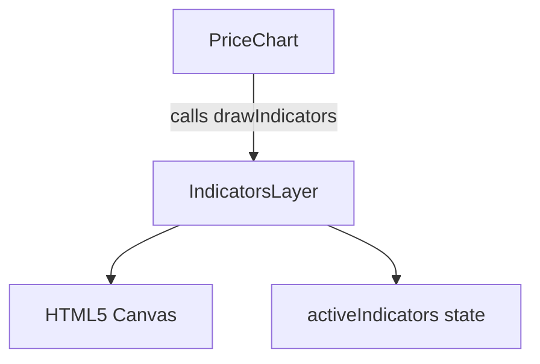
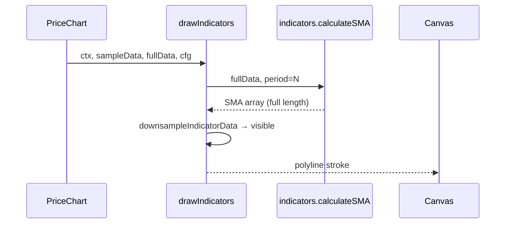
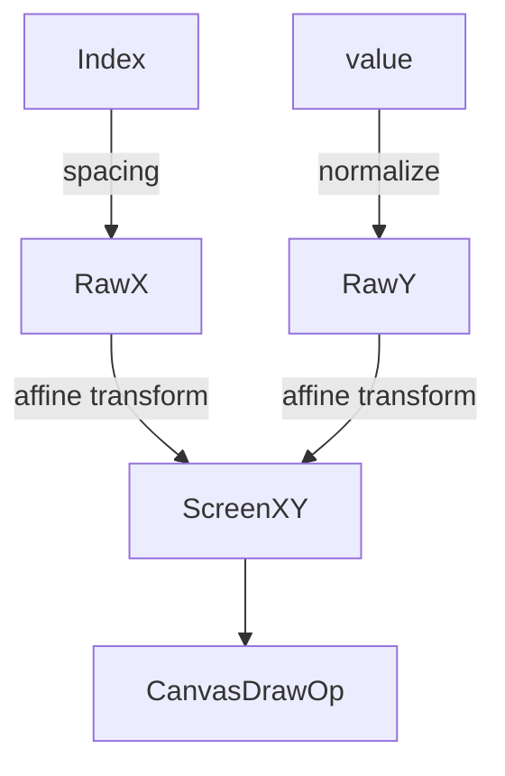

# `UI/src/charts/drawIndicators.js`

🔍 **Purpose:** Overlay technical indicators (SMA, EMA, RSI, MACD, Bollinger Bands, Stochastic, ATR, Ichimoku) on top of any price-chart variant (candle, line, bar). Uses the full data-set for mathematical accuracy but down-samples results so the drawing workload always matches the on-screen candle count.

---

## Big-picture design goals  
Turn raw price data into accurate, high-performance indicator overlays:
| Stage | What we compute / draw                | How we do it                                                         | UX payoff                                      |
|-------|---------------------------------------|----------------------------------------------------------------------|-------------------------------------------------|
| 1 · Helpers            | `getX`, `getY`, `downsampleIndicatorData`       | Centralise affine transform & down-sampling                          | 1-pixel alignment with grid; fast redraws       |
| 2 · Moving averages    | SMA, EMA curves                                 | Compute on `fullData` → down-sample → cyan/green polylines          | Trend smoothing; user can overlay many periods  |
| 3 · Oscillators        | RSI, MACD, Stochastic, ATR                      | Reserve 20 % height strip each; draw fills/lines                    | Momentum & volatility without cluttering price  |
| 4 · Volatility envelope| Bollinger Bands upper/mid/lower                 | Three 1 px lines, color-coded                                       | Quick read of contraction/expansion phases      |
| 5 · Cloud              | Ichimoku span A/B fill + lines                  | Semi-transparent green/red cloud                                     | Support/resistance “at a glance”                |
| 6 · Colour & width     | Cycling palette or user-chosen `cfg.color`       | `idx % 5` palette fallback                                          | Visual differentiation when many active         |

---

## Relevant theory / tools
* **Simple/Exponential MA** – lag-reducing smoothers  
* **RSI** – bounded 0–100 momentum oscillator  
* **MACD** – `EMA(12) – EMA(26)` line + signal + histogram  
* **Bollinger Bands** – ±multiplier·σ envelope around SMA  
* **Stochastic %K/%D** – price location inside recent high/low window  
* **ATR** – true-range average, proxy for volatility  
* **Ichimoku** – cloud of future support/resistance  
* **Affine transform** – `(coord – center) * zoom + center + offset`  

---

### Part 1 – Algorithm logic (high-level)

```javascript
// 1. Pre-compute chart geometry
const chartWidth  = canvas.width  - padding.left - padding.right;
const chartHeight = canvas.height - padding.top  - padding.bottom;
const allValues   = fullData.map(d => d.close);
const minPrice    = Math.min(...allValues) * 0.9995;
const maxPrice    = Math.max(...allValues) * 1.0005;

// 2. Down-sample indicators
//    keep at most one point per visible candle → O(N_visible)

// 3. Iterate in order:
//    SMA → EMA → RSI → MACD → Bollinger → Stochastic → ATR → Ichimoku

// 4. Draw each indicator:
//    choose color (cfg.color or palette)
//    ctx.beginPath()
//    loop down-sampled data → ctx.moveTo/lineTo()
//    ctx.stroke()
//    for filled clouds/histograms → ctx.fillStyle + ctx.fillRect()
```











```mermaid
classDiagram
    class drawIndicators {
        <<utility>>
        +drawIndicators(ctx, canvas, sampleData, fullData, activeIndicators, cfg)
        -getX(index, visibleCount)
        -getY(value, min, max)
        -downsampleIndicatorData(srcArray, visibleCount)
    }
